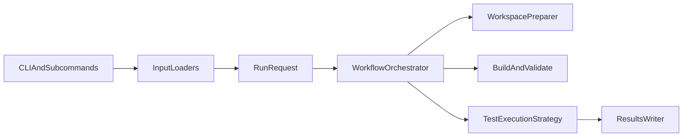

# Rerun Test Tool

这是一个面向 Java flaky test 研究与实验的重跑工具。当前版本支持两类工作流：

1. `verify-patch`
   将 `generated_patch` 应用到目标测试，再构建并多次重跑，用来验证补丁是否消除不稳定性。
2. `detect-flaky`
   完全不改源码，直接把原始 flaky test 作为输入，多次重跑观察其稳定性；可选使用 `NonDex` 作为执行后端。


## 架构概览



这套拆分的好处是：

- `verify-patch` 和 `detect-flaky` 可以共用克隆、构建、结果输出逻辑。
- `standard` 和 `nondex` 可以作为执行策略独立演进，而不是把条件分支堆在一个函数里。
- 后续如果要新增别的 runner 或别的 workspace preparation 方式，改动范围会更小。

代价是模块数比以前更多，理解入口时需要先接受“请求对象 + 工作流 + 执行策略”这三个层次。

## 目录说明

- `rerun_tool/`
  核心实现，包含输入解析、工作流编排、补丁应用、执行后端和结果写出。
- `patch-data/`
  现有补丁验证数据集。
- `reference-paper/`
  论文材料。
- `workspace/`
  运行时克隆下来的目标仓库。
- `results/`
  结果输出目录。
- `tests/`
  本工具自己的 Python 单元测试。

## 运行前准备

推荐环境如下：

- Python `3.10+`
- Git
- Docker
- 本地 Maven 或 Gradle
  权衡：不是绝对必须，但建议安装，因为 `--docker auto` 在部分项目上会读取构建工具版本信息来辅助判断兼容性。

本项目当前不依赖额外 Python 三方库，默认使用标准库即可运行。

先检查环境：

```bash
python3 --version  # 检查 Python 版本
git --version  # 检查 Git 是否可用
docker info  # 检查 Docker 守护进程是否已启动
mvn -version  # 可选：检查 Maven 及其实际使用的 JDK
```

如果 `docker info` 失败，你仍然可以使用 `--docker never` 走本地模式。
权衡：启动更快、手工调试更直接；但跨项目兼容性会下降，尤其是旧 Java 项目。

## 快速开始

### 1. 运行本仓库单元测试

```bash
python3 -m unittest discover -s tests -v  # 先验证工具本身没有坏
```

### 2. 旧版兼容入口：补丁验证

```bash
python3 -m rerun_tool --csv patch-data/cleaned_mutation_data.csv --rows 1 --rerun 1 --docker auto -o results/legacy_smoke.csv  # 旧命令仍然可用，默认等价于 verify-patch
```

### 3. 新版显式入口：补丁验证

```bash
python3 -m rerun_tool verify-patch --csv patch-data/cleaned_mutation_data.csv --rows 1 --rerun 1 --docker auto -o results/verify_patch_smoke.csv  # 使用新子命令做补丁验证
```

### 4. 新版显式入口：patchless flaky 检测

```bash
python3 -m rerun_tool detect-flaky --repo-url https://github.com/SAP/emobility-smart-charging --sha 53c97ae60625a3e89a130213551840e455b74ae6 --full-test-name com.sap.charging.model.FuseTreeTest.testToJSON.testToJSON --module . --rerun 3 --docker auto -o results/detect_flaky_smoke.csv  # 单条 CLI 输入做 patchless 检测
```

## 工作流说明

### `verify-patch`

适用场景：

- 你已经有 `generated_patch`
- 你关心“补丁是否消除了 flakiness”

流程如下：

1. 克隆仓库并检出 `original_sha`
2. 定位测试文件
3. 应用补丁
4. 构建
5. 如果是补丁模式且首次构建失败，尝试做保守的 import 自动修复
6. 多次重跑测试

优点：

- 可以直接回答“补丁后是否稳定”
- 会自动处理一部分常见 import 缺失问题

缺点：

- 会修改工作区源码
- 如果补丁本身质量差，失败可能来自补丁而不是测试本身

### `detect-flaky`

适用场景：

- 你没有补丁
- 你只想检测原始测试是否不稳定

流程如下：

1. 克隆仓库并检出 `original_sha`
2. 定位测试文件
3. 不改源码
4. 构建
5. 多次重跑测试

优点：

- 语义干净，完全不污染原始源码
- 既适合单条 CLI 调试，也适合批量 CSV 扫描

缺点：

- 不能自动修复补丁相关的编译问题，因为本模式本来就不应该改源码
- 只能观测 flaky 行为，不能回答“补丁是否修好”

## 执行后端

### `--runner standard`

这是默认后端，直接使用普通 Maven Surefire 或 Gradle test 进行多次重跑。

优点：

- 兼容性最好
- 支持 Maven 和 Gradle
- 与旧版行为最接近

缺点：

- 对某些顺序依赖或迭代顺序敏感问题，暴露能力有限

### `--runner nondex`

这是可选后端，当前仅支持 Maven，通过 `edu.illinois:nondex-maven-plugin:2.1.7:nondex` 执行。

优点：

- 对顺序相关 flaky 更敏感
- 更适合做 patchless flaky detection 的增强复现

缺点：

- 当前只支持 Maven 项目
- 比 `standard` 更慢
- 目前只支持 `--mode isolated`

示例：

```bash
python3 -m rerun_tool detect-flaky --repo-url https://github.com/SAP/emobility-smart-charging --sha 53c97ae60625a3e89a130213551840e455b74ae6 --full-test-name com.sap.charging.model.FuseTreeTest.testToJSON.testToJSON --module . --runner nondex --rerun 3 --docker auto -o results/detect_flaky_nondex.csv  # 使用 NonDex 做 patchless 检测
```

## 输入方式

### 1. 补丁验证 CSV

`verify-patch` 使用现有补丁数据集，至少需要这些字段：

- `repo_url`
- `original_sha`
- `module`
- `full_test_name`
- `generated_patch`

旧接口与新接口都支持它：

```bash
python3 -m rerun_tool --csv patch-data/cleaned_mutation_data.csv --limit 5 --rerun 3 --docker auto -o results/legacy_batch.csv  # 旧版兼容形式
python3 -m rerun_tool verify-patch --csv patch-data/cleaned_mutation_data.csv --limit 5 --rerun 3 --docker auto -o results/verify_patch_batch.csv  # 新版显式形式
```

### 2. patchless flaky CSV

`detect-flaky` 支持更简化的 CSV，至少需要：

- `repo_url`
- `original_sha`
- `module`
- `full_test_name`

最小示例：

```csv
repo_url,original_sha,module,full_test_name
https://github.com/SAP/emobility-smart-charging,53c97ae60625a3e89a130213551840e455b74ae6,.,com.sap.charging.model.FuseTreeTest.testToJSON.testToJSON
```

运行方式：

```bash
python3 -m rerun_tool detect-flaky --csv flaky_inputs.csv --rerun 5 --docker auto -o results/flaky_batch.csv  # 批量读取 patchless flaky CSV
```

### 3. 单条 CLI 输入

如果你只想快速调试一个测试，不需要先写 CSV：

```bash
python3 -m rerun_tool detect-flaky --repo-url https://github.com/SAP/emobility-smart-charging --sha 53c97ae60625a3e89a130213551840e455b74ae6 --full-test-name com.sap.charging.model.FuseTreeTest.testToJSON.testToJSON --module . --rerun 5 --docker auto -o results/flaky_single.csv  # 单条 CLI 输入做 patchless 检测
```

权衡：

- 单条 CLI 最快，最适合调试
- CSV 最适合批量实验

## 常用参数

### 选择样本

- `--rows 0,1,2`
  权衡：最适合复现单个或少量问题；但不适合大批量实验。
- `--limit 10`
  权衡：适合冒烟测试和小批量试跑；但如果数据集顺序本身有偏差，代表性有限。
- `--project commons-lang`
  权衡：适合按项目分组排查环境问题；但 patchless 单条 CLI 模式通常不需要它。

### 重跑相关

- `--rerun`
  权衡：次数越大，越容易观察 flakiness；但耗时线性增加。
- `--mode isolated`
  权衡：隔离性最好，也是 `nondex` 当前唯一支持的模式；但单次开销更大。
- `--mode same_jvm`
  权衡：更适合模拟状态污染；但当前只适用于 `--runner standard`。

### 执行环境

- `--docker auto`
  权衡：通用性最好，推荐默认使用；但第一次拉镜像会比较慢。
- `--docker always`
  权衡：跨机器复现最稳定；但首次准备时间更长。
- `--docker never`
  权衡：本地调试最方便；但对 JDK/Maven/Gradle 版本更敏感。

### 恢复执行

- `--resume`
  权衡：适合长时间批量实验中断后继续跑；但如果你想重新复测同一个输出文件里的已完成条目，就不要开它。

示例：

```bash
python3 -m rerun_tool verify-patch --csv patch-data/cleaned_mutation_data.csv --limit 20 --rerun 3 --docker auto -o results/verify_patch_batch.csv --resume  # 从已有结果文件中恢复 verify-patch 批任务
python3 -m rerun_tool detect-flaky --csv flaky_inputs.csv --runner nondex --rerun 3 --docker auto -o results/flaky_nondex_batch.csv --resume  # 从已有结果文件中恢复 patchless NonDex 批任务
```

## 输出结果说明

结果会写入 CSV。当前版本的设计原则是：

- 保留 `rerun_results` 这一列里的 JSON 数组，例如 `["pass", "pass", "fail"]`
- 不再把每一轮结果展开成 `run_1`、`run_2`、`run_3` 这种超长列
- 额外补充总耗时、纯 rerun 耗时，以及关键阶段 checkpoint 的阶段 verdict 和耗时

这样做的好处是：

- 结果表宽度可控，批量实验时不会因为 `rerun=50` 或 `rerun=100` 变得非常难读
- 原始逐轮结果仍然完整保留在 `rerun_results` 中，后续做自定义统计也不会丢信息
- 关键阶段信息被显式结构化，便于直接筛选“前 10 次已经 flaky”或“前 20 次仍稳定”的样本

代价是：

- 如果你想直接在 Excel 里按单轮次做透视，就需要先把 `rerun_results` 这一列展开
- 阶段列只保留关键 checkpoint，而不是每一轮的明细列

除了旧版字段，现在还会显式写出工作流语义与耗时信息：

- `request_key`
  稳定请求键，用于 `--resume`
- `workflow`
  当前工作流，取值如 `verify_patch`、`detect_flaky`
- `runner_backend`
  当前执行后端，取值如 `standard`、`nondex`
- `input_source`
  输入来源，取值如 `patch_csv`、`flaky_csv`、`cli`
- `patch_mode`
  当前是否带补丁，取值如 `with_patch`、`no_patch`
- `status`
  主流程状态，例如 `completed`、`build_failed`、`patch_failed`、`unsupported_runner`
- `rerun_results`
  每次重跑的结果数组，格式类似 `["pass", "fail", "pass"]`
- `pass_count` / `fail_count` / `error_count`
  统计信息
- `total_elapsed_seconds`
  从开始处理该条样本到结束的总耗时，包含克隆、依赖下载、构建、补丁应用和 rerun
- `rerun_elapsed_seconds`
  纯 rerun 阶段的总耗时，不包含克隆、下载和构建
- `checkpoint_<N>_verdict`
  前 `N` 次 rerun 的阶段性 verdict
- `checkpoint_<N>_total_elapsed_seconds`
  从该条样本开始处理到完成第 `N` 次 rerun 的总耗时
- `checkpoint_<N>_rerun_elapsed_seconds`
  从开始 rerun 到完成第 `N` 次 rerun 的纯 rerun 耗时
- `verdict`
  综合结论

### checkpoint 列如何生成

规则如下：

- 如果 `--rerun` 小于等于 `10`，只保留最终阶段
- 如果 `--rerun` 大于 `10`，默认保留每 `10` 次一个 checkpoint，再加最终阶段

示例：

- `--rerun 5`
  会生成 `checkpoint_5_*`
- `--rerun 15`
  会生成 `checkpoint_10_*` 和 `checkpoint_15_*`
- `--rerun 50`
  会生成 `checkpoint_10_*`、`checkpoint_20_*`、`checkpoint_30_*`、`checkpoint_40_*`、`checkpoint_50_*`

### 如何理解 checkpoint verdict

`checkpoint_10_verdict` 的意思不是“第 10 次运行是否通过”，而是“前 10 次整体看下来是什么结论”。

例如：

- 前 10 次全是 `pass`
  则 `checkpoint_10_verdict = STABLE_PASS`
- 前 10 次既有 `pass` 又有 `fail`
  则 `checkpoint_10_verdict = FLAKY`
- 前 10 次全是 `fail`
  则 `checkpoint_10_verdict = STABLE_FAIL`
- 前 10 次全是 `error`
  则 `checkpoint_10_verdict = RUN_ERROR`

### 一行结果示意

下面是一个经过压缩后的结果行示意：

```csv
request_key,status,rerun_results,total_elapsed_seconds,rerun_elapsed_seconds,checkpoint_10_verdict,checkpoint_10_total_elapsed_seconds,checkpoint_10_rerun_elapsed_seconds,checkpoint_20_verdict,checkpoint_20_total_elapsed_seconds,checkpoint_20_rerun_elapsed_seconds,verdict
detect_flaky|standard|demo|...,completed,"[""pass"",""pass"",""pass"",""fail""]",38.421,11.204,STABLE_PASS,31.552,4.335,FLAKY,38.421,11.204,FLAKY
```

这里可以直接看出：

- 前 10 次还是稳定通过
- 跑到前 20 次后才暴露 flaky
- 总耗时和纯 rerun 耗时是分开的

### 如何理解 `verdict`

- 在 `verify_patch` 中：
  - `STABLE_PASS` 表示补丁后多次重跑都通过
  - `FLAKY` 表示补丁后仍然有不稳定性
- 在 `detect_flaky` 中：
  - `FLAKY` 表示原始测试在当前 runner 下表现不稳定
  - `STABLE_PASS` 表示原始测试在当前配置下稳定通过
  - `STABLE_FAIL` 表示原始测试稳定失败

也就是说，同一个 `verdict` 在不同 `workflow` 下语义不同，解读时一定要结合 `workflow` 一起看。

## 推荐使用姿势

### 场景 A：你已经有补丁，想验证修复效果

```bash
python3 -m rerun_tool verify-patch --csv patch-data/cleaned_mutation_data.csv --rows 1 --rerun 5 --docker auto -o results/verify_patch_one.csv  # 先复现单条补丁验证样本
python3 -m rerun_tool verify-patch --csv patch-data/cleaned_mutation_data.csv --project fastjson --limit 10 --rerun 5 --docker auto -o results/verify_patch_fastjson.csv  # 再按项目做小批量补丁验证
```

### 场景 B：你没有补丁，只想找 flaky

```bash
python3 -m rerun_tool detect-flaky --csv flaky_inputs.csv --rerun 5 --runner standard --docker auto -o results/flaky_standard.csv  # 先用标准后端做基线检测
python3 -m rerun_tool detect-flaky --csv flaky_inputs.csv --rerun 5 --runner nondex --docker auto -o results/flaky_nondex.csv  # 再用 NonDex 提高顺序相关问题暴露概率
```

权衡：

- `standard` 适合做兼容性更强的第一轮扫描
- `nondex` 适合做更激进的第二轮确认

## 实战教程

### 教程 1：先用一条样本验证整条链路

适用场景：

- 你刚改完代码
- 你想先确认 clone、build、rerun、结果写出都没坏

```bash
python3 -m rerun_tool verify-patch --csv patch-data/cleaned_mutation_data.csv --rows 1 --rerun 3 --docker auto -o results/tutorial_verify_patch_one.csv  # 用一条补丁样本做最小端到端检查
```

权衡：

- 最省时间，适合先冒烟
- 代表性有限，不能说明批量数据一定都稳定

### 教程 2：批量补丁验证并支持中断恢复

适用场景：

- 你已经有一批 `generated_patch`
- 你担心中途网络或构建失败导致任务中断

```bash
python3 -m rerun_tool verify-patch --csv patch-data/incorrect_patch.csv --limit 20 --rerun 20 --docker auto -o results/tutorial_verify_patch_batch.csv --resume  # 批量补丁验证并允许断点续跑
```

权衡：

- 最适合长任务和大批量实验
- 如果你本来就是想从头重跑全部样本，就不要加 `--resume`

### 教程 3：不写 CSV，直接调单个 flaky test

适用场景：

- 你只想看某一个测试
- 你不想先手工整理 CSV

```bash
python3 -m rerun_tool detect-flaky --repo-url https://github.com/SAP/emobility-smart-charging --sha 53c97ae60625a3e89a130213551840e455b74ae6 --full-test-name com.sap.charging.model.FuseTreeTest.testToJSON.testToJSON --module . --rerun 20 --runner standard --docker auto -o results/tutorial_single_flaky.csv  # 直接对单条 flaky test 做 patchless 检测
```

权衡：

- 输入最快，最适合调试
- 不适合成规模批处理

### 教程 4：先用 standard 扫描，再用 NonDex 复核

适用场景：

- 你希望先要兼容性，再要更强的暴露能力
- 你怀疑存在顺序依赖类 flaky

```bash
python3 -m rerun_tool detect-flaky --csv flaky_inputs.csv --rerun 20 --runner standard --docker auto -o results/tutorial_flaky_standard.csv  # 第一步先用 standard 做基线扫描
python3 -m rerun_tool detect-flaky --csv flaky_inputs.csv --rerun 20 --runner nondex --docker auto -o results/tutorial_flaky_nondex.csv  # 第二步再用 NonDex 做增强复核
```

权衡：

- `standard` 更稳，适合作为第一轮
- `nondex` 更激进，但更慢，而且当前只支持 Maven

### 教程 5：当你关心 50 次 rerun 的阶段性变化

适用场景：

- 你需要更高置信度的 flaky 观测
- 你不只关心最终 verdict，还关心“第几阶段开始暴露问题”

```bash
python3 -m rerun_tool detect-flaky --csv flaky_inputs.csv --rerun 50 --runner standard --docker auto -o results/tutorial_rerun50.csv  # 运行 50 次并输出 10/20/30/40/50 阶段统计
```

跑完后可以重点看这些列：

- `checkpoint_10_verdict`
- `checkpoint_20_verdict`
- `checkpoint_30_verdict`
- `checkpoint_40_verdict`
- `checkpoint_50_verdict`

以及对应的：

- `checkpoint_10_total_elapsed_seconds` / `checkpoint_10_rerun_elapsed_seconds`
- `checkpoint_20_total_elapsed_seconds` / `checkpoint_20_rerun_elapsed_seconds`
- `checkpoint_30_total_elapsed_seconds` / `checkpoint_30_rerun_elapsed_seconds`
- `checkpoint_40_total_elapsed_seconds` / `checkpoint_40_rerun_elapsed_seconds`
- `checkpoint_50_total_elapsed_seconds` / `checkpoint_50_rerun_elapsed_seconds`

权衡：

- 可以更细地观察 flaky 暴露过程
- 总耗时会显著高于 `--rerun 5` 或 `--rerun 10`

### 教程 6：如何判断耗时主要花在构建还是 rerun

适用场景：

- 你想优化实验吞吐
- 你发现某些项目特别慢，想判断慢在构建还是慢在测试执行

看同一行里的两列即可：

- `total_elapsed_seconds`
- `rerun_elapsed_seconds`

如果：

- `total_elapsed_seconds` 远大于 `rerun_elapsed_seconds`
  说明主要时间花在克隆、依赖下载、构建或补丁应用
- 两者差距不大
  说明主要时间花在真正的 rerun 阶段

权衡：

- 这种判断非常直观，适合先粗看瓶颈
- 但它不能替代更细粒度的 profiler，只能做阶段级分析

## 本地安装

### Docker

```bash
git clone <你的仓库地址> rerun-test  # 克隆本工具仓库到新电脑
cd rerun-test  # 进入项目根目录
python3 -m unittest discover -s tests -v  # 先验证工具本身
python3 -m rerun_tool verify-patch --csv patch-data/cleaned_mutation_data.csv --rows 1 --rerun 1 --docker auto -o results/migrate_verify_patch.csv  # 用补丁验证样本检查新机器
python3 -m rerun_tool detect-flaky --repo-url https://github.com/SAP/emobility-smart-charging --sha 53c97ae60625a3e89a130213551840e455b74ae6 --full-test-name com.sap.charging.model.FuseTreeTest.testToJSON.testToJSON --module . --rerun 1 --docker auto -o results/migrate_detect_flaky.csv  # 用 patchless 单条检测检查新机器
```


## 常见问题

### 1. 为什么 `detect-flaky` 不会自动修复 import

因为它的目标是“观测原始测试是否 flaky”，不是“修改源码让它过”。
权衡：这样语义最干净；代价是 patchless 模式不能像补丁验证那样帮你修补新增 import。

### 2. 为什么 `--runner nondex` 只支持 Maven

当前 NonDex 集成是通过 Maven 插件触发的。我们选择先把 Maven 路径做稳，而不是对 Gradle 做不完整的模拟支持。
权衡：能力边界更明确；代价是当前阶段 `nondex` 不能覆盖 Gradle 项目。

### 3. 为什么旧命令还保留

因为已有批处理脚本和实验流程可能都在用旧接口：

```bash
python3 -m rerun_tool --csv patch-data/cleaned_mutation_data.csv --limit 5 --rerun 3 --docker auto -o results/legacy.csv  # 旧命令仍然兼容
```

权衡：向后兼容最好；代价是 README 和 CLI 里需要同时解释“新子命令”和“旧兼容入口”。

### 4. 什么时候应该优先用 `detect-flaky`

当你没有补丁、或者你想把“测试本身是否 flaky”和“补丁是否修好”这两个问题分开时，优先用 `detect-flaky`。

### 5. 什么时候应该优先用 `verify-patch`

当你已经有 `generated_patch`，并且真正关心的是“应用补丁后是否稳定通过”，优先用 `verify-patch`。
