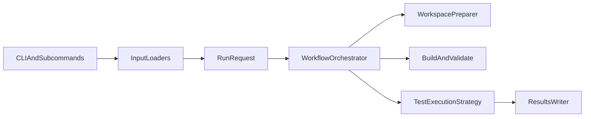

# Rerun Test Tool

这是一个面向 Java flaky test 研究与实验的重跑工具。当前版本支持两类工作流：

1. `verify-patch`
   将 `generated_patch` 应用到目标测试，再构建并多次重跑，用来验证补丁是否消除不稳定性。
2. `detect-flaky`
   完全不改源码，直接把原始 flaky test 作为输入，多次重跑观察其稳定性；可选使用 `NonDex` 作为执行后端。

相比旧版本，现在的核心变化是：

- 输入模型不再被“必须有补丁”绑死。
- 执行方式不再只有一种普通 rerun，而是支持 `standard` 与 `nondex` 两类后端。
- CLI 被改成“按工作流组织”，同时保留旧命令兼容入口。

## 架构概览



这套拆分的好处是：

- `verify-patch` 和 `detect-flaky` 可以共用克隆、构建、结果输出逻辑。
- `standard` 和 `nondex` 可以作为执行策略独立演进，而不是把条件分支堆在一个函数里。
- 后续如果要新增别的 runner 或别的 workspace preparation 方式，改动范围会更小。

代价是模块数比以前更多，理解入口时需要先接受“请求对象 + 工作流 + 执行策略”这三个层次。

## 目录说明

- `rerun_tool/`
  核心实现，包含输入解析、工作流编排、补丁应用、执行后端和结果写出。
- `patch-data/`
  现有补丁验证数据集。
- `reference-paper/`
  论文材料。
- `workspace/`
  运行时克隆下来的目标仓库。
- `results/`
  结果输出目录。
- `tests/`
  本工具自己的 Python 单元测试。

## 运行前准备

推荐环境如下：

- Python `3.10+`
- Git
- Docker
- 本地 Maven 或 Gradle
  权衡：不是绝对必须，但建议安装，因为 `--docker auto` 在部分项目上会读取构建工具版本信息来辅助判断兼容性。

本项目当前不依赖额外 Python 三方库，默认使用标准库即可运行。

先检查环境：

```bash
python3 --version  # 检查 Python 版本
git --version  # 检查 Git 是否可用
docker info  # 检查 Docker 守护进程是否已启动
mvn -version  # 可选：检查 Maven 及其实际使用的 JDK
```

如果 `docker info` 失败，你仍然可以使用 `--docker never` 走本地模式。
权衡：启动更快、手工调试更直接；但跨项目兼容性会下降，尤其是旧 Java 项目。

## 快速开始

### 1. 运行本仓库单元测试

```bash
python3 -m unittest discover -s tests -v  # 先验证工具本身没有坏
```

### 2. 旧版兼容入口：补丁验证

```bash
python3 -m rerun_tool --csv patch-data/cleaned_mutation_data.csv --rows 1 --rerun 1 --docker auto -o results/legacy_smoke.csv  # 旧命令仍然可用，默认等价于 verify-patch
```

### 3. 新版显式入口：补丁验证

```bash
python3 -m rerun_tool verify-patch --csv patch-data/cleaned_mutation_data.csv --rows 1 --rerun 1 --docker auto -o results/verify_patch_smoke.csv  # 使用新子命令做补丁验证
```

### 4. 新版显式入口：patchless flaky 检测

```bash
python3 -m rerun_tool detect-flaky --repo-url https://github.com/SAP/emobility-smart-charging --sha 53c97ae60625a3e89a130213551840e455b74ae6 --full-test-name com.sap.charging.model.FuseTreeTest.testToJSON.testToJSON --module . --rerun 3 --docker auto -o results/detect_flaky_smoke.csv  # 单条 CLI 输入做 patchless 检测
```

## 工作流说明

### `verify-patch`

适用场景：

- 你已经有 `generated_patch`
- 你关心“补丁是否消除了 flakiness”

流程如下：

1. 克隆仓库并检出 `original_sha`
2. 定位测试文件
3. 应用补丁
4. 构建
5. 如果是补丁模式且构建失败，最多做 3 轮保守自动修复，包括普通 import、static import 和明显的类名大小写修正
6. 多次重跑测试

优点：

- 可以直接回答“补丁后是否稳定”
- 会自动处理一部分常见 import 缺失、static import 缺失和明显的符号大小写问题

缺点：

- 会修改工作区源码
- 如果补丁本身质量差，失败可能来自补丁而不是测试本身

### `detect-flaky`

适用场景：

- 你没有补丁
- 你只想检测原始测试是否不稳定

流程如下：

1. 克隆仓库并检出 `original_sha`
2. 定位测试文件
3. 不改源码
4. 构建
5. 多次重跑测试

优点：

- 语义干净，完全不污染原始源码
- 既适合单条 CLI 调试，也适合批量 CSV 扫描

缺点：

- 不能自动修复补丁相关的编译问题，因为本模式本来就不应该改源码
- 只能观测 flaky 行为，不能回答“补丁是否修好”

## 执行后端

### `--runner standard`

这是默认后端，直接使用普通 Maven Surefire 或 Gradle test 进行多次重跑。

优点：

- 兼容性最好
- 支持 Maven 和 Gradle
- 与旧版行为最接近

缺点：

- 对某些顺序依赖或迭代顺序敏感问题，暴露能力有限

### `--runner nondex`

这是可选后端，当前仅支持 Maven，通过 `edu.illinois:nondex-maven-plugin:2.1.7:nondex` 执行。

优点：

- 对顺序相关 flaky 更敏感
- 更适合做 patchless flaky detection 的增强复现

缺点：

- 当前只支持 Maven 项目
- 比 `standard` 更慢
- 目前只支持 `--mode isolated`

示例：

```bash
python3 -m rerun_tool detect-flaky --repo-url https://github.com/SAP/emobility-smart-charging --sha 53c97ae60625a3e89a130213551840e455b74ae6 --full-test-name com.sap.charging.model.FuseTreeTest.testToJSON.testToJSON --module . --runner nondex --rerun 3 --docker auto -o results/detect_flaky_nondex.csv  # 使用 NonDex 做 patchless 检测
```

## 输入方式

### 1. 补丁验证 CSV

`verify-patch` 使用现有补丁数据集，至少需要这些字段：

- `repo_url`
- `original_sha`
- `module`
- `full_test_name`
- `generated_patch`

旧接口与新接口都支持它：

```bash
python3 -m rerun_tool --csv patch-data/cleaned_mutation_data.csv --limit 5 --rerun 3 --docker auto -o results/legacy_batch.csv  # 旧版兼容形式
python3 -m rerun_tool verify-patch --csv patch-data/cleaned_mutation_data.csv --limit 5 --rerun 3 --docker auto -o results/verify_patch_batch.csv  # 新版显式形式
```

### 2. patchless flaky CSV

`detect-flaky` 支持更简化的 CSV，至少需要：

- `repo_url`
- `original_sha`
- `module`
- `full_test_name`

最小示例：

```csv
repo_url,original_sha,module,full_test_name
https://github.com/SAP/emobility-smart-charging,53c97ae60625a3e89a130213551840e455b74ae6,.,com.sap.charging.model.FuseTreeTest.testToJSON.testToJSON
```

运行方式：

```bash
python3 -m rerun_tool detect-flaky --csv flaky_inputs.csv --rerun 5 --docker auto -o results/flaky_batch.csv  # 批量读取 patchless flaky CSV
```

### 3. 单条 CLI 输入

如果你只想快速调试一个测试，不需要先写 CSV：

```bash
python3 -m rerun_tool detect-flaky --repo-url https://github.com/SAP/emobility-smart-charging --sha 53c97ae60625a3e89a130213551840e455b74ae6 --full-test-name com.sap.charging.model.FuseTreeTest.testToJSON.testToJSON --module . --rerun 5 --docker auto -o results/flaky_single.csv  # 单条 CLI 输入做 patchless 检测
```

权衡：

- 单条 CLI 最快，最适合调试
- CSV 最适合批量实验

## 常用参数

### 选择样本

- `--rows 0,1,2`
  权衡：最适合复现单个或少量问题；但不适合大批量实验。
- `--limit 10`
  权衡：适合冒烟测试和小批量试跑；但如果数据集顺序本身有偏差，代表性有限。
- `--project commons-lang`
  权衡：适合按项目分组排查环境问题；但 patchless 单条 CLI 模式通常不需要它。

### 重跑相关

- `--rerun`
  权衡：次数越大，越容易观察 flakiness；但耗时线性增加。
- `--mode isolated`
  权衡：隔离性最好，也是 `nondex` 当前唯一支持的模式；但单次开销更大。
- `--mode same_jvm`
  权衡：更适合模拟状态污染；但当前只适用于 `--runner standard`。

### 执行环境

- `--docker auto`
  权衡：通用性最好，推荐默认使用；但第一次拉镜像会比较慢，而且只有在本地 JDK 被明确判定为兼容时才会回退到本地执行。
- `--docker always`
  权衡：跨机器复现最稳定，也最严格；但首次准备时间更长，而且如果 Docker 守护进程不可用或镜像拉取失败，会直接报错而不是静默改走本地环境。
- `--docker never`
  权衡：本地调试最方便；但对 JDK/Maven/Gradle 版本更敏感。

### Git 准备相关

- `--git-timeout`
  权衡：默认值现在是 `2400` 秒，且 clone/fetch 会优先使用更轻量的 partial clone / filtered fetch，适合大仓库、慢网络或大提交检出场景；但设置过大也会延后真实错误的暴露时间。
- `--git-retries`
  权衡：适合吸收 `early EOF`、连接重置、TLS 抖动这类瞬时 Git 网络问题；但设置过高会拉长不可恢复故障的失败时间。

### 恢复执行

- `--resume`
  权衡：适合长时间批量实验中断后继续跑；当前会继续保留已完成结果，但会自动重新执行上次的 `clone_failed` 和 `build_failed` 条目。代价是如果你本来就是想保留这些失败样本而不再重跑，就不要开它。

示例：

```bash
python3 -m rerun_tool verify-patch --csv patch-data/cleaned_mutation_data.csv --limit 20 --rerun 3 --docker auto -o results/verify_patch_batch.csv --resume  # 从已有结果文件中恢复 verify-patch 批任务
python3 -m rerun_tool detect-flaky --csv flaky_inputs.csv --runner nondex --rerun 3 --docker auto -o results/flaky_nondex_batch.csv --resume  # 从已有结果文件中恢复 patchless NonDex 批任务
```

## 输出结果说明

结果会写入 CSV。当前版本的设计原则是：

- 保留 `rerun_results` 这一列里的 JSON 数组，例如 `["pass", "pass", "fail"]`
- 不再把每一轮结果展开成 `run_1`、`run_2`、`run_3` 这种超长列
- 额外补充总耗时、纯 rerun 耗时，以及关键阶段 checkpoint 的阶段 verdict 和耗时

这样做的好处是：

- 结果表宽度可控，批量实验时不会因为 `rerun=50` 或 `rerun=100` 变得非常难读
- 原始逐轮结果仍然完整保留在 `rerun_results` 中，后续做自定义统计也不会丢信息
- 关键阶段信息被显式结构化，便于直接筛选“前 10 次已经 flaky”或“前 20 次仍稳定”的样本
- 控制台会持续输出整体进度，包含总量、当前批次完成数、已保留的历史结果数、自动重跑的历史失败数，以及剩余待处理数量

代价是：

- 如果你想直接在 Excel 里按单轮次做透视，就需要先把 `rerun_results` 这一列展开
- 阶段列只保留关键 checkpoint，而不是每一轮的明细列

除了旧版字段，现在还会显式写出工作流语义与耗时信息：

- `request_key`
  稳定请求键，用于 `--resume`
- `workflow`
  当前工作流，取值如 `verify_patch`、`detect_flaky`
- `runner_backend`
  当前执行后端，取值如 `standard`、`nondex`
- `input_source`
  输入来源，取值如 `patch_csv`、`flaky_csv`、`cli`
- `patch_mode`
  当前是否带补丁，取值如 `with_patch`、`no_patch`
- `original_rerun_consistency`
  从原始补丁输入 CSV 透传出来的 `rerun_consistency` 字段。这个字段能把 rerun 结果和原始数据集标签直接对齐，便于后续筛查“原始标签一致但 rerun 失败”这类样本。
- `status`
  主流程状态，例如 `completed`、`build_failed`、`patch_failed`、`unsupported_runner`
- `rerun_results`
  每次重跑的结果数组，格式类似 `["pass", "fail", "pass"]`
- `pass_count` / `fail_count` / `error_count`
  统计信息
- `total_elapsed_seconds`
  从开始处理该条样本到结束的总耗时，包含克隆、依赖下载、构建、补丁应用和 rerun
- `rerun_elapsed_seconds`
  纯 rerun 阶段的总耗时，不包含克隆、下载和构建
- `checkpoint_<N>_verdict`
  前 `N` 次 rerun 的阶段性 verdict
- `checkpoint_<N>_total_elapsed_seconds`
  从该条样本开始处理到完成第 `N` 次 rerun 的总耗时
- `checkpoint_<N>_rerun_elapsed_seconds`
  从开始 rerun 到完成第 `N` 次 rerun 的纯 rerun 耗时
- `verdict`
  综合结论
- `error_message`
  会尽量保留 clone、fetch、checkout、build 的具体阶段、尝试次数和关键错误尾部；如果 `verdict = RUN_ERROR`，这里也会尽量保留测试执行阶段的关键输出尾部，便于直接从结果表定位问题

### checkpoint 列如何生成

规则如下：

- 如果 `--rerun` 小于等于 `10`，只保留最终阶段
- 如果 `--rerun` 大于 `10`，默认保留每 `10` 次一个 checkpoint，再加最终阶段

示例：

- `--rerun 5`
  会生成 `checkpoint_5_*`
- `--rerun 15`
  会生成 `checkpoint_10_*` 和 `checkpoint_15_*`
- `--rerun 50`
  会生成 `checkpoint_10_*`、`checkpoint_20_*`、`checkpoint_30_*`、`checkpoint_40_*`、`checkpoint_50_*`

### 如何理解 checkpoint verdict

`checkpoint_10_verdict` 的意思不是“第 10 次运行是否通过”，而是“前 10 次整体看下来是什么结论”。

例如：

- 前 10 次全是 `pass`
  则 `checkpoint_10_verdict = STABLE_PASS`
- 前 10 次既有 `pass` 又有 `fail`
  则 `checkpoint_10_verdict = FLAKY`
- 前 10 次全是 `fail`
  则 `checkpoint_10_verdict = STABLE_FAIL`
- 前 10 次全是 `error`
  则 `checkpoint_10_verdict = RUN_ERROR`

这里的 `RUN_ERROR` 更具体地表示：

- 主流程已经进入了测试执行阶段，所以它不同于 `clone_failed` / `build_failed`
- 但每一轮 rerun 都没有得到真正的 `pass` 或 `fail`，而是落成了执行错误
- 常见原因包括测试未匹配到、测试 JVM 启动失败、运行期基础设施错误，或者测试执行阶段再次遇到编译/环境问题
- 现在优先看同一行的 `error_message`，通常能直接看到最后一次测试执行的关键错误尾部

### 一行结果示意

下面是一个经过压缩后的结果行示意：

```csv
request_key,status,rerun_results,total_elapsed_seconds,rerun_elapsed_seconds,checkpoint_10_verdict,checkpoint_10_total_elapsed_seconds,checkpoint_10_rerun_elapsed_seconds,checkpoint_20_verdict,checkpoint_20_total_elapsed_seconds,checkpoint_20_rerun_elapsed_seconds,verdict
detect_flaky|standard|demo|...,completed,"[""pass"",""pass"",""pass"",""fail""]",38.421,11.204,STABLE_PASS,31.552,4.335,FLAKY,38.421,11.204,FLAKY
```

这里可以直接看出：

- 前 10 次还是稳定通过
- 跑到前 20 次后才暴露 flaky
- 总耗时和纯 rerun 耗时是分开的

### 如何理解 `verdict`

- 在 `verify_patch` 中：
  - `STABLE_PASS` 表示补丁后多次重跑都通过
  - `FLAKY` 表示补丁后仍然有不稳定性
- 在 `detect_flaky` 中：
  - `FLAKY` 表示原始测试在当前 runner 下表现不稳定
  - `STABLE_PASS` 表示原始测试在当前配置下稳定通过
  - `STABLE_FAIL` 表示原始测试稳定失败

也就是说，同一个 `verdict` 在不同 `workflow` 下语义不同，解读时一定要结合 `workflow` 一起看。

## 针对失败集的优化过程

这一节只记录我们围绕 `verify_patch_batch_build_run_failures_*` 这批失败集做过的排查和修复。目的不是写总结，而是给后面继续优化的人留下能直接复用的证据链。

### 第一轮

第一轮针对的是：

- `results/verify_patch_batch_build_run_failures_rerun1.csv`
- `results/verify_patch_batch_build_run_failures_rerun1_diagnosis.csv`

当时混在一起的主要问题有三类：

- 结果判定不稳。日志里明明已经有 Surefire 摘要，但旧逻辑还会把 `STABLE_PASS` 或 `STABLE_FAIL` 误记成 `RUN_ERROR`。
- 自动修复太激进。它会盲目补 `JsonPath`、`JSONAssert`、`assertThat` 一类高风险符号，结果把原本还能修的补丁修坏。
- `error_message` 截断太早。很多行只保留了前部框架日志，真正根因在末尾被切掉，后续几乎无法复盘。

围绕这些问题，第一轮做了这些修复：

- 结果判定改成优先相信 Surefire 摘要。真正通过记为 `pass`，真正断言失败记为 `fail`，编译和环境问题才记为 `error`。
- Maven 构建和测试统一追加保守的格式检查、前端构建、许可证扫描跳过参数，减少与目标测试无关的噪声。
- 自动修复改成保守模式，不再盲目给三方 JSON 库和 `assertThat` 猜依赖。
- 当自动修复失败时，开始回退到 `nondex_script/patch` 里的参考补丁候选。
- 结果 CSV 的 `error_message` 会保留更长上下文，并且优先保留真正的错误尾部。

### 第二轮

第二轮针对的是：

- `results/verify_patch_batch_build_run_failures_rerun1_v2.csv`
- `results/verify_patch_batch_build_run_failures_rerun1_v2_diagnosis.csv`

`v2`里总共有 `415` 条记录。逐条复核后可以分成两部分：

- `251` 条已经不是构建失败。其中 `220` 条是 `STABLE_PASS`，`31` 条是 `STABLE_FAIL`。
- 剩下 `164` 条才是仍然没有构建成功的样本。

这 `164` 条在 `v2_diagnosis.csv` 里被分成下面几类：

- `reference_patch_missing_context`: `72`
  典型表现是目标测试文件缺少参考补丁附带的 `import` 或 `pom` 依赖上下文，例如 `JsonPath`、`JSONAssert`、`ObjectMapper`、`MockMvcRequestBuilders`、`assertThat`。
- `reference_patch_api_mismatch`: `52`
  典型表现是补丁直接调用了当前目标版本里不存在的 helper 或 API，例如 `assertThatJson`、`assertJsonEqualsNonStrict`、`assertJSONEqual`、`convertJsonToOrderedMap`、`getHost`、`getPort`。
- `invalid_java_source_or_patch_text`: `14`
  典型表现是非法字符、字符串未闭合或源码文本本身不可编译。`JSON-java` 这一批最明显。
- `non_target_module_compile_failure`: `10`
  典型表现是失败文件根本不在目标测试类里，而是在别的模块先炸掉。当前最典型的是 `seatunnel` 的 `seatunnel-config-shade`。
- `dependency_resolution_failure`: `10`
  典型表现是公共依赖解析仍然被宿主机 Maven 镜像或缓存污染。`timely` 这批会卡在 `maven.aliyun.com` 上的 `netty-tcnative`。
- `checked_exception_missing_throws`: `4`
  典型表现是补丁新增调用引入了 checked exception，但方法声明没有同步补 `throws`。`jmeter-datadog-backend-listener` 属于这一类。
- `missing_symbol_other`: `2`
  这两条都是 `Gaffer`，日志在结果 CSV 里已经不足以恢复具体符号名，只能先单列出来。

第二轮据此又补了几项工具侧改动：

- 结果输出新增 `original_rerun_consistency`，直接透传原始输入 CSV 里的 `rerun_consistency`。
- 参考补丁候选不再只拿 `test_code`。现在会合并重复候选里的 `imports` 和 `pom_snippet`，避免把有用上下文在去重时丢掉。
- 参考补丁真正落地时，会同步把 `import` 和依赖片段写进工作区，而不是只替换测试方法。
- 自动修复新增 checked exception 处理，能根据编译日志自动补目标方法的 `throws` 声明。
- Maven 命令统一使用隔离后的 settings 文件、`-U` 和独立本地仓库，避免宿主机 `~/.m2/settings.xml` 和旧缓存污染这批实验。
- 结果压缩逻辑会同时保留“自动修复历史”或“参考补丁回退历史”和最终错误尾部，便于后续继续查。

### 第三轮

第三轮针对的是：

- `results/verify_patch_batch_build_run_failures_rerun1_v3.csv`
- `results/verify_patch_batch_build_run_failures_rerun1_v3_diagnosis.csv`

`v3`是第二轮代码重新跑出来的结果。这里最关键的结论不是“还有 30% 失败”，而是前两轮真正的根问题还没有完全打通。根问题有三个：

- Docker 环境没有完全模拟真实构建链路。Maven 命令虽然已经切进容器，但 `-s` 后面传给容器的仍然是宿主机绝对路径，容器内根本看不到这个 settings 文件。
- 参考补丁上下文仍然只吃显式 `import:` 和 `pom:`。很多参考补丁的 `test_code` 已经明显依赖 `JsonPath`、`DocumentContext`、`JsonParser`、`JSONAssert`、`assertThatJson`，但补丁文件本身没把上下文写全，工具也没有继续从正文推断。
- 自动修复仍然会把局部变量误判成类型名。最典型的是 `shenyu` 这批的 `list->List`，这不是补丁语义问题，而是修复器自己引入了新的编译错误。

`v3`里共有 `415` 条记录，其中：

- `281` 条已经完成，包含 `242` 条 `STABLE_PASS` 和 `39` 条 `STABLE_FAIL`
- `134` 条仍然是 `BUILD_ERROR`

这 `134` 条按当前日志重新归因后，最关键的分布是：

- `docker_settings_path_bug`: `64`
  典型报错是 `The specified user settings file does not exist`，路径直接指向宿主机工作区里的 `.rerun_tool.maven-settings.xml`。这说明 Docker 路径改写链路没有闭合。
- `reference_patch_missing_context`: `16`
  典型报错仍然围绕 `JsonPath`、`DocumentContext`、`JSONAssert`、`JsonParser`、`assertThatJson`，说明参考补丁正文已经换了方案，但上下文没补齐。
- `invalid_java_source_or_patch_text`: `14`
  这一批还是 `JSON-java` 为主，属于补丁文本本身不可编译。
- `non_target_module_compile_failure`: `10`
  这一批主要还是 `seatunnel`，失败点在目标测试之外的模块。
- `dependency_resolution_failure`: `10`
  这一批主要还是 `timely`，属于依赖解析和镜像链路问题。
- `unsafe_symbol_case_repair`: `8`
  这一批全部来自 `shenyu` 的 `list->List` 误修。

第三轮据此补了这几项关键修复：

- Docker 中的 Maven 命令参数现在会把宿主机上的 settings 文件路径改写成容器内的 `/workspace/.rerun_tool.maven-settings.xml`。这样容器才能真正使用我们生成的隔离 settings，而不是继续报路径不存在。
- 参考补丁上下文不再只依赖补丁文件显式写出的 `import:` 和 `pom:`。现在会从 `test_code` 正文里推断高频上下文，并自动补齐对应 import 和依赖。当前覆盖了 `JsonPath`、`DocumentContext`、`ReadContext`、`JSONAssert`、`JsonParser`、`JsonObject`、`JsonNode`、`ObjectMapper`、`JSONException`、`assertThatJson` 等高频信号。
- 参考补丁的 pom 注入不再只吃第一个 `<dependency>` 片段。现在可以按顺序处理多个 dependency，并按 `groupId:artifactId` 去重。
- 自动修复新增了“只允许类型名做大小写修正”的保护。像 `JsonPath->JSONPath` 这种类名大小写修正仍然允许，但 `list->List` 这种局部变量误修会直接被拦住。
- 这轮同时补了回归测试，专门覆盖 Docker settings 路径改写、参考补丁正文推断依赖、以及禁止 `list->List` 误修这三类问题。

### 第四轮

第四轮针对的是：

- `results/verify_patch_batch_build_run_failures_rerun1_v4.csv`
- `results/verify_patch_batch_build_run_failures_rerun1_v4_diagnosis.csv`

`v4`是第三轮代码重新跑出来的结果。这里剩下的失败已经不再是“结果判定不准”这一类宽问题，而是集中在少数几个项目的构建链缺口上。`v4`里共有 `415` 条记录，其中：

- `359` 条已经完成，包含 `318` 条 `STABLE_PASS` 和 `41` 条 `STABLE_FAIL`
- `56` 条仍然是 `BUILD_ERROR`

这 `56` 条在 `v4_diagnosis.csv` 里被归成下面几类：

- `json_java_patch_text_or_javac_edge_case`: `14`
  这一批都在 `JSON-java`。`v4`结果里表现为 `JSONMLTest` 附近的非法字符或非法表达式。进一步复现后可以看到，这个项目在 Docker 的 `maven:3.8.6-openjdk-11` 下可以稳定通过干净仓库的 `test-compile`，而在 JDK8 路径上更容易出现 `javac` 边界问题。这里的根因已经不是简单的缺 import 或缺依赖，而是旧源码级别项目和 JDK8 编译器组合的兼容性问题。
- `reference_patch_anchor_mismatch`: `11`
  主要是 `shenyu`、`crane4j` 和 `botbuilder-java`。这些样本在参考补丁库里已经有更干净的候选，但回退时我们仍然拿原始数据里的 `flaky_code` 去校验目标方法。一旦原始 `flaky_code` 失真，参考补丁就会被挡住。
- `shaded_module_preinstall_missing`: `10`
  这一批都是 `seatunnel`。失败点不在目标测试文件，而在上游的 `seatunnel-config-shade`。根因是我们一直只跑 `test-compile -pl seatunnel-api -am`，但这个项目需要先把 shaded 模块产物 `install` 到隔离本地仓库。
- `docker_os_classifier_mismatch`: `10`
  这一批都是 `timely`。根因已经被手工复现确认：`os-maven-plugin` 在当前环境把架构识别成了 `linux-x86_32`，于是 Maven 去拉一个根本不存在的 `netty-tcnative` classifier。只要强制成 `linux-x86_64`，`timely-server` 就能正常 `BUILD SUCCESS`。
- `assertj_assert_that_resolution_gap`: `7`
  这一批都是 `druid`。参考补丁里是典型的 AssertJ 链式断言，例如 `assertThat(...).containsExactlyInAnyOrderElementsOf(...)`，但我们的 `assertThat` 识别规则过窄，没有把它认成 AssertJ。
- `reference_patch_anchor_and_jsonparser_resolution_gap`: `2`
  这一批是 `shenyu` 里直接缺 `JsonParser` 的样本。这里同时有两个问题：参考补丁回退仍会受旧 `flaky_code` 影响，自动导入又没有把当前文件的 Gson 语境识别出来。
- `missing_json_symbol_context`: `2`
  这一批是 `pulsar`。最终仍然缺 `JSONException`，说明当前选中的补丁或参考候选没有给出足够明确的 JSON 依赖上下文。

第四轮据此补了这几项关键修复：

- 参考补丁回退不再沿用原始数据里的 `flaky_code` 做方法锚点。现在会直接使用候选自身的 `test_code` 作为锚点，这样就不会被失真的原始方法文本挡住。
- `assertThat` 的 AssertJ 识别继续收紧但更完整。现在除了已有的链式断言外，还能识别 `containsExactlyInAnyOrderElementsOf(...)` 这类 Druid 实际用到的 AssertJ 风格；同时会结合仓库里的 `assertj-core` 依赖和 `org.assertj.core.api.Assertions` 证据来决定是否补 AssertJ 的 static import。
- `JsonParser` 新增了上下文推断。当前文件如果明显处在 Gson 语境，比如出现 `parseString(...)`、`getAsJsonObject()`、`JsonObject`、`JsonElement`、`GsonUtils`，就会保守地补 `com.google.gson.JsonParser`。
- Maven 构建参数新增了项目级 `os.detected.classifier` 覆盖。当仓库确实显式依赖 `${os.detected.classifier}` 时，工具会按当前架构稳定生成 `linux-x86_64` 或 `linux-aarch_64`，避免 `timely` 这类项目在 Docker 或本地环境中被误识别成 `linux-x86_32`。
- Maven 构建新增了一个 `seatunnel` 目标链恢复分支。当前如果日志明确指向 `seatunnel-config-shade` 和 `ConfigParser.java` 这批缺失符号，工具不会再只预装单个 shade 模块，而是先执行 `install -pl seatunnel-api -am -DskipTests` 这类完整 target reactor install，再重试目标模块构建。手工复现已经确认，这比只装 `seatunnel-config-shade` 稳定得多。
- Docker 镜像选择新增了项目级 JDK 覆盖。当前会把 `JSON-java` 从默认的 JDK8 镜像提升到 `maven:3.8.6-openjdk-11`，用来绕开这个项目在旧编译器上的已知边界问题，同时继续保留其他老项目按原始源码级别选镜像的默认逻辑。
- 这轮也补了回归测试，覆盖参考补丁锚点切换、AssertJ 新识别规则、Gson `JsonParser` 推断、`timely` classifier 覆盖、`seatunnel` 的 target reactor install 恢复，以及 `JSON-java` 的 Docker JDK 覆盖。

### 第五轮

第五轮针对的是：

- `results/verify_patch_batch_build_run_failures_rerun1_v5.csv`

这一轮最重要的结论不是“参考补丁不够好”，而是我们把参考补丁和`fixed_code`放进运行时主流程这件事本身就错了。`v5`里共有 `415` 条记录，其中 `65` 条仍然是 `BUILD_ERROR`。把这些失败按唯一案例去重后，只剩 `15` 个真正不同的案例，但其中有 `49` 条失败都带着同一个信号：

- `Target method mismatch`

这说明上一轮的运行时方案从方法论上就有问题。真实评估场景里，我们只能把原始`generated_patch`贴到原始项目再构建和rerun，不能在运行时切到参考补丁，也不能切到`fixed_code`。一旦主流程里混入这些“已知成功代码”，就会把“评估补丁”偷偷变成“替换补丁”。

这一轮重新核对后，真正起作用的因素更清楚了。参考补丁库和`fixed_code`真正提供的是离线证据，而不是运行时候选：

- `15/15` 个唯一失败案例都能在`patch-data/cleaned_mutation_data.csv`里找到精确匹配的原始数据行。这说明参考库确实和我们的数据同源，但它只能拿来解释“成功样本里有哪些上下文因素”。
- 很多成功样本并不是“方法体更对”，而是“上下文更完整”。这批`15`个唯一失败案例里，有`10`个案例在参考补丁或ground truth里明确出现了`throws`、`ObjectMapper`、`JsonNode`、`JSONAssert`、`JsonPath`、`DocumentContext`、`CollectionUtils`这类结构化比较或辅助API。它们往往正是让原始`generated_patch`可编译、可运行的关键因素。
- 真正应该后移的不是所有JSON相关API，而是那些明显像补丁工具幻觉出来的helper，比如`assertJsonEqualsNonStrict`、`assertJsonStringEquals`、`assertJSONEqual`这类项目里并不存在的名字。
- `fixed_code`是ground truth，只能用于离线归因。它来自`pr_link`对应修复提交之后的测试代码，不能被拿来替代当前要评估的补丁。

围绕这些证据，后来我们把方法论重新纠正成下面这套：

- 参考补丁库和`fixed_code`只用于离线分析。它们帮助我们总结哪些import、dependency、`throws`和标准API会让原始补丁编过，但不再进入真实rerun流程。
- 真实运行时只会重新应用原始`generated_patch`。如果初始构建失败，工具只会从当前`generated_patch`本身和原始方法签名里推断缺失的import、dependency和checked exception。
- `apply_patch()`仍然围绕原始测试方法定位，避免把补丁贴到错误方法。Docker、Maven参数、模块reactor恢复和JDK选择继续负责把原始项目环境复现出来。
- “风险helper”判断继续保留，但只拦明显虚构的helper名，不会再把`JSONAssert`、`JsonPath`、`ObjectMapper`这类稳定API整体打成高风险。

这一轮要解决的不是单个项目的特例，而是把“参考补丁为什么能成功”的几个共性因素真正抽出来，再落成不会作弊的运行时规则：

- 原始`generated_patch`始终是唯一被评估对象
- 结构化比较API和必要`throws`是成功因素，不应该被误判成噪声
- import、dependency和方法声明要作为一个整体补齐
- 只有明显的幻觉helper才应该被后移

### 还没有彻底解决的点

下面这些问题目前仍然不能靠通用工具逻辑完全吃掉：

- `JSON-java`
  当前已经确认至少有一部分失败是 JDK8 编译器路径导致的，所以工具里先加了 JDK11 Docker 覆盖。但参考补丁落地后的个别样本还需要继续确认是补丁文本本身有问题，还是只是在旧镜像里被放大了。要继续推进，优先建议单独保留补丁后的工作区做 JDK8/JDK11 对比，而不是继续在 import 或依赖层面猜修。
- `pulsar` 的 `JSONException`
  这两条还缺更明确的 JSON 语境证据。下一步更适合优先选用能直接编译通过的参考补丁，而不是继续让自动修补去猜第三方 JSON 库。
- 仍然可能存在的补丁版本不兼容
  工具现在已经把能确认的环境、Docker、参考回退和依赖链问题继续收紧了。剩下如果还失败，就更可能是补丁本身和目标仓库版本不兼容。

如果后面要继续优化，建议直接从 `results/verify_patch_batch_build_run_failures_rerun1_v4_diagnosis.csv` 开始筛：

- 先重跑 `docker_os_classifier_mismatch` 和 `shaded_module_preinstall_missing`，这两类已经有明确的工具侧修复，而且都是构建链路问题，不是补丁语义问题。
- 再重跑 `reference_patch_anchor_mismatch` 和 `assertj_assert_that_resolution_gap`，这一批最可能因为第四轮的参考回退和 AssertJ 修复继续下降。
- 最后单独盯 `JSON-java` 和 `pulsar`。这两类已经不适合再用“大而全”的通用修复逻辑去猜，应该走单项目环境验证和参考补丁比对。

## 推荐使用姿势

### 场景 A：你已经有补丁，想验证修复效果

```bash
python3 -m rerun_tool verify-patch --csv patch-data/cleaned_mutation_data.csv --rows 1 --rerun 5 --docker auto -o results/verify_patch_one.csv  # 先复现单条补丁验证样本
python3 -m rerun_tool verify-patch --csv patch-data/cleaned_mutation_data.csv --project fastjson --limit 10 --rerun 5 --docker auto -o results/verify_patch_fastjson.csv  # 再按项目做小批量补丁验证
```

### 场景 B：你没有补丁，只想找 flaky

```bash
python3 -m rerun_tool detect-flaky --csv flaky_inputs.csv --rerun 5 --runner standard --docker auto -o results/flaky_standard.csv  # 先用标准后端做基线检测
python3 -m rerun_tool detect-flaky --csv flaky_inputs.csv --rerun 5 --runner nondex --docker auto -o results/flaky_nondex.csv  # 再用 NonDex 提高顺序相关问题暴露概率
```

权衡：

- `standard` 适合做兼容性更强的第一轮扫描
- `nondex` 适合做更激进的第二轮确认

## 实战教程

### 教程 1：先用一条样本验证整条链路

适用场景：

- 你刚改完代码
- 你想先确认 clone、build、rerun、结果写出都没坏

```bash
python3 -m rerun_tool verify-patch --csv patch-data/cleaned_mutation_data.csv --rows 1 --rerun 3 --docker auto -o results/tutorial_verify_patch_one.csv  # 用一条补丁样本做最小端到端检查
```

权衡：

- 最省时间，适合先冒烟
- 代表性有限，不能说明批量数据一定都稳定

### 教程 2：批量补丁验证并支持中断恢复

适用场景：

- 你已经有一批 `generated_patch`
- 你担心中途网络或构建失败导致任务中断

```bash
python3 -m rerun_tool verify-patch --csv patch-data/incorrect_patch.csv --limit 20 --rerun 20 --docker auto -o results/tutorial_verify_patch_batch.csv --resume  # 批量补丁验证并允许断点续跑
```

权衡：

- 最适合长任务和大批量实验
- 如果你本来就是想从头重跑全部样本，就不要加 `--resume`
- 如果你希望自动重新尝试上次的 `clone_failed` / `build_failed` 样本，应该保留 `--resume`

### 教程 3：不写 CSV，直接调单个 flaky test

适用场景：

- 你只想看某一个测试
- 你不想先手工整理 CSV

```bash
python3 -m rerun_tool detect-flaky --repo-url https://github.com/SAP/emobility-smart-charging --sha 53c97ae60625a3e89a130213551840e455b74ae6 --full-test-name com.sap.charging.model.FuseTreeTest.testToJSON.testToJSON --module . --rerun 20 --runner standard --docker auto -o results/tutorial_single_flaky.csv  # 直接对单条 flaky test 做 patchless 检测
```

权衡：

- 输入最快，最适合调试
- 不适合成规模批处理

### 教程 4：先用 standard 扫描，再用 NonDex 复核

适用场景：

- 你希望先要兼容性，再要更强的暴露能力
- 你怀疑存在顺序依赖类 flaky

```bash
python3 -m rerun_tool detect-flaky --csv flaky_inputs.csv --rerun 20 --runner standard --docker auto -o results/tutorial_flaky_standard.csv  # 第一步先用 standard 做基线扫描
python3 -m rerun_tool detect-flaky --csv flaky_inputs.csv --rerun 20 --runner nondex --docker auto -o results/tutorial_flaky_nondex.csv  # 第二步再用 NonDex 做增强复核
```

权衡：

- `standard` 更稳，适合作为第一轮
- `nondex` 更激进，但更慢，而且当前只支持 Maven

### 教程 5：当你关心 50 次 rerun 的阶段性变化

适用场景：

- 你需要更高置信度的 flaky 观测
- 你不只关心最终 verdict，还关心“第几阶段开始暴露问题”

```bash
python3 -m rerun_tool detect-flaky --csv flaky_inputs.csv --rerun 50 --runner standard --docker auto -o results/tutorial_rerun50.csv  # 运行 50 次并输出 10/20/30/40/50 阶段统计
```

跑完后可以重点看这些列：

- `checkpoint_10_verdict`
- `checkpoint_20_verdict`
- `checkpoint_30_verdict`
- `checkpoint_40_verdict`
- `checkpoint_50_verdict`

以及对应的：

- `checkpoint_10_total_elapsed_seconds` / `checkpoint_10_rerun_elapsed_seconds`
- `checkpoint_20_total_elapsed_seconds` / `checkpoint_20_rerun_elapsed_seconds`
- `checkpoint_30_total_elapsed_seconds` / `checkpoint_30_rerun_elapsed_seconds`
- `checkpoint_40_total_elapsed_seconds` / `checkpoint_40_rerun_elapsed_seconds`
- `checkpoint_50_total_elapsed_seconds` / `checkpoint_50_rerun_elapsed_seconds`

权衡：

- 可以更细地观察 flaky 暴露过程
- 总耗时会显著高于 `--rerun 5` 或 `--rerun 10`

### 教程 6：如何判断耗时主要花在构建还是 rerun

适用场景：

- 你想优化实验吞吐
- 你发现某些项目特别慢，想判断慢在构建还是慢在测试执行

看同一行里的两列即可：

- `total_elapsed_seconds`
- `rerun_elapsed_seconds`

如果：

- `total_elapsed_seconds` 远大于 `rerun_elapsed_seconds`
  说明主要时间花在克隆、依赖下载、构建或补丁应用
- 两者差距不大
  说明主要时间花在真正的 rerun 阶段

权衡：

- 这种判断非常直观，适合先粗看瓶颈
- 但它不能替代更细粒度的 profiler，只能做阶段级分析

## 配置到其他电脑

### 方案 A：Docker 优先

适用场景：

- 你希望最大化跨机器一致性
- 你要跑批量实验

优点：

- 复现性最好
- 对本地 JDK 依赖较小

缺点：

- 第一次拉镜像和依赖会比较慢
- 需要保证 Docker 可用，且磁盘空间足够

```bash
git clone <你的仓库地址> rerun-test  # 克隆本工具仓库到新电脑
cd rerun-test  # 进入项目根目录
python3 -m unittest discover -s tests -v  # 先验证工具本身
python3 -m rerun_tool verify-patch --csv patch-data/cleaned_mutation_data.csv --rows 1 --rerun 1 --docker auto -o results/migrate_verify_patch.csv  # 用补丁验证样本检查新机器
python3 -m rerun_tool detect-flaky --repo-url https://github.com/SAP/emobility-smart-charging --sha 53c97ae60625a3e89a130213551840e455b74ae6 --full-test-name com.sap.charging.model.FuseTreeTest.testToJSON.testToJSON --module . --rerun 1 --docker auto -o results/migrate_detect_flaky.csv  # 用 patchless 单条检测检查新机器
```

### 方案 B：本地构建优先

适用场景：

- 你没有 Docker
- 你想直接在本机调试 Maven/Gradle/JDK 问题

优点：

- 启动更快
- 更容易直接观察本机构建链问题

缺点：

- 对 JDK、Maven、Gradle 版本更敏感
- 对旧 Java 项目不够稳定

```bash
python3 -m rerun_tool verify-patch --csv patch-data/cleaned_mutation_data.csv --limit 5 --rerun 3 --docker never -o results/local_verify_patch.csv  # 强制本地执行补丁验证
python3 -m rerun_tool detect-flaky --csv flaky_inputs.csv --rerun 3 --runner standard --docker never -o results/local_detect_flaky.csv  # 强制本地执行 patchless 检测
```

### Windows 建议

优先推荐 `WSL2 + Docker Desktop`。

权衡：

- 与当前命令行和路径习惯更接近
- 比直接在纯 Windows `cmd` 下跑批量实验更稳定

## 常见问题

### 1. 为什么 `detect-flaky` 不会自动修复 import

因为它的目标是“观测原始测试是否 flaky”，不是“修改源码让它过”。
权衡：这样语义最干净；代价是 patchless 模式不能像补丁验证那样帮你修补新增 import。

### 2. 为什么 `--runner nondex` 只支持 Maven

当前 NonDex 集成是通过 Maven 插件触发的。我们选择先把 Maven 路径做稳，而不是对 Gradle 做不完整的模拟支持。
权衡：能力边界更明确；代价是当前阶段 `nondex` 不能覆盖 Gradle 项目。

### 3. `--docker always` 为什么现在不再自动回退到本地

因为显式要求 Docker 的语义应该是“必须在容器环境中执行”，否则很容易把镜像或 JDK 问题误当成项目本身的 flaky 或构建问题。
权衡：环境语义更清晰，跨机器复现更稳定；代价是当 Docker 本身有问题时会更早失败，需要先修复基础设施。

### 4. 为什么旧命令还保留

因为已有批处理脚本和实验流程可能都在用旧接口：

```bash
python3 -m rerun_tool --csv patch-data/cleaned_mutation_data.csv --limit 5 --rerun 3 --docker auto -o results/legacy.csv  # 旧命令仍然兼容
```

权衡：向后兼容最好；代价是 README 和 CLI 里需要同时解释“新子命令”和“旧兼容入口”。

### 5. 什么时候应该优先看结果 CSV 里的 `error_message`

当批量任务里出现大量 `clone_failed` 或 `build_failed` 时，先看结果表里的 `error_message`，因为里面已经会保留具体失败阶段和关键错误尾部。
如果你还需要看完整上下文，再配合 `--log-file` 查看逐次尝试日志，这时更适合排查“为什么这一批仓库都在同一阶段失败”。

### 6. 什么时候应该优先用 `detect-flaky`

当你没有补丁、或者你想把“测试本身是否 flaky”和“补丁是否修好”这两个问题分开时，优先用 `detect-flaky`。

### 7. 什么时候应该优先用 `verify-patch`

当你已经有 `generated_patch`，并且真正关心的是“应用补丁后是否稳定通过”，优先用 `verify-patch`。

## 第五轮复盘

这一轮重新检查了`results/verify_patch_batch_build_run_failures_rerun1_v5.csv`，并生成了逐条归因文件`results/verify_patch_batch_build_run_failures_rerun1_v5_diagnosis.csv`。`v5`里共有`65`条`BUILD_ERROR`，真正的主因已经不是Docker本身，而是参考补丁回退链路没有把“原始方法结构”“API兼容性”“补丁上下文”一起处理。

### `v5`里真正的根因

- `49`条是`reference_anchor_guard_regression`
  参考补丁已经找到了，但回退阶段仍然把候选补丁自身当成锚点，还保留了严格的`Target method mismatch`保护。很多项目目标方法在文件里本来就是唯一的，这一步把正确候选也误拒了。
- `10`条是`original_patch_autorepair_misfire`
  这批失败不是Docker镜像问题，而是自动修复在缺少参考上下文时把代码修坏了。典型例子是`shenyu`里的`list`变量缺失，以及`crane4j`把`CollectionUtils`误修成项目内同名类。
- `2`条是`reference_context_inference_gap`
  典型例子是`pulsar`。参考候选正文里没有显式写`JSONException`，但真正贴补丁时保留了原始方法声明里的`throws JSONException`。旧逻辑只看候选正文，不看原始方法声明，所以不会补`import org.json.JSONException;`和`org.json`依赖。
- `2`条是`reference_patch_verification_failure`
  典型例子是`vjtools`。命中的参考候选文本本身结构损坏，大括号不平衡，补丁验证阶段直接失败。
- `2`条是`reference_candidate_api_mismatch`
  典型例子是`botbuilder-java`和`vjtools`。选中的参考候选依赖`assertJsonEqualsNonStrict`或`assertJSONEqual`这类在原始SHA里并不存在的helper，看起来像“正确修复”，但实际上在当前项目版本里根本编不过。

### 参考补丁里真正有用的因素

这一轮把`nondex_script/patch`和`patch-data/cleaned_mutation_data.csv`一起对照后，可以更清楚地看到“为什么有些参考补丁能编过”。这里的重点是学习成功因素，不是把这些文件带进运行时：

- 最重要的不是“它来自参考库”，而是它保留了原始方法的结构
  能成功构建的候选通常会保留原始测试方法的签名、局部变量、对象初始化和前置准备语句，只替换最容易引入flakiness的断言部分。
- 好候选通常使用原始SHA里更稳定的API
  `assertEquals`、`AssertJ`、`ObjectMapper`、`JSONAssert`、`JsonPath`这类标准或常见库更稳。`assertJsonEqualsNonStrict`、`assertJsonStringEquals`、`assertJSONEqual`这类helper在参考库里虽然出现过，但在原始项目版本里往往并不存在。
- import、dependency 和原始方法声明要一起看
  很多参考候选正文并不会把所有上下文都写全。真正能编过，往往靠的是“候选正文 + 原始方法声明 + 明确的pom片段”三者一起补齐。
- `fixed_code`不是运行时候选
  `fixed_code`经常最接近真实人工修复，但它来自修复提交之后的版本，只能作为ground truth去解释“成功修复里引入了什么因素”。
- `GoodPatches`也不是运行时候选
  `GoodPatches`只说明另一个补丁生成工具曾经在它自己的流程里把这个样本跑通。它对我们真正有价值的地方，是暴露了哪些import、dependency、`throws`和标准API在原始SHA上是必要的。

### 这轮工具侧的改动

- 把参考补丁依赖彻底移出运行时
  真实rerun流程不再查询`nondex_script/patch`，也不再读取`fixed_code`作为可回放补丁。
- 新增`generated_patch`自身的上下文增强路径
  当原始补丁首次构建失败时，工具会回到干净基线，重新应用原始`generated_patch`，再只根据这个补丁正文和原始方法签名补import、dependency和`throws`。
- 保留离线参考分析代码，但明确不进入主流程
  参考补丁检索和相似度过滤现在只服务于离线诊断、归因和后续规则提炼，不再参与真实执行链路。

## 第六轮复盘

第六轮修正的是第五轮留下的一个根本性错误。前面几轮虽然已经越来越清楚地看到参考补丁库里哪些因素有用，但工具实现仍然保留了“运行时借用参考补丁上下文”的路径。这会带来两个问题：

- 它依赖真实场景里并不存在的外部成功样本
- 它会模糊“我们在评估原始`generated_patch`”和“我们在借另一个补丁救场”之间的边界

这一轮之后，运行时主流程明确只做下面几件事：

- clone原始项目，并在Docker里尽量完整复现该项目需要的JDK、Maven settings、os classifier和模块reactor
- 把原始`generated_patch`贴到原始测试文件
- 如果构建失败，只从原始`generated_patch`自身和原始方法签名推断缺失的import、dependency和checked exception
- 再次构建并rerun

参考补丁库现在只保留两种作用：

- 离线归因。看成功样本里到底多了哪些import、dependency、`throws`和标准API
- 规则提炼。把这些成功因素抽成不会作弊的通用规则，再放回运行时

当前代码里的对应实现是：

- `workflow.py`不再在运行时查询参考补丁候选，失败后只会走`generated_patch`自身的上下文增强
- `patch.py`里的import和dependency推断规则，来自离线成功样本归纳，但运行时只喂当前样本自己的`generated_patch`
- `results.py`和失败诊断前缀也同步改成了`Generated patch context history`
- 实际部署时即使没有`nondex_script/patch`和`patch-data`目录，主流程也仍然可以运行。那两部分现在只服务于离线分析和规则提炼。

### 和Docker的关系

这一轮复盘后的结论是：

- `v5`里剩余的大头失败不是Docker容器没有把项目跑起来
- 更核心的问题是“补丁虽然进了容器，但补丁本身没被正确选中、没被正确贴上、或者没把所需上下文一起补齐”

也就是说，Docker的职责仍然是稳定复现原始项目环境。真正影响容器内是否能构建成功的，是原始`generated_patch`有没有被正确贴到目标方法、有没有补齐它自己缺的import、dependency和`throws`，以及项目级JDK、模块reactor、settings和classifier有没有被正确复现。单独把镜像换得再像，也修不好一个上下文缺失或贴错位置的原始补丁。

### 本轮新增回归测试

- 运行时在构建失败后只会走原始`generated_patch`自身的上下文增强
- 原始`generated_patch`的上下文推断可以独立补出import和pom依赖
- 离线参考候选检索只读取参考补丁目录，不再混入ground truth或其他数据集代码
