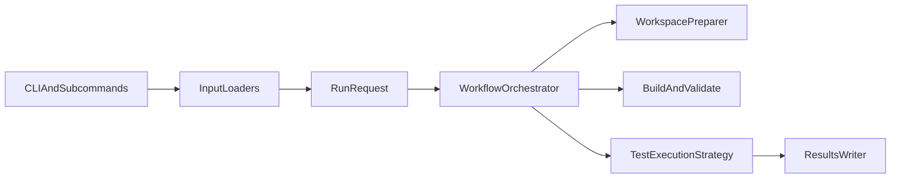

# Rerun Test Tool

这是一个面向 Java flaky test 研究与实验的重跑工具。当前版本支持两类工作流：

1. `verify-patch`
   将 `generated_patch` 应用到目标测试，再构建并多次重跑，用来验证补丁是否消除不稳定性。
2. `detect-flaky`
   完全不改源码，直接把原始 flaky test 作为输入，多次重跑观察其稳定性；可选使用 `NonDex` 作为执行后端。


## 架构概览



这套拆分的好处是：

- `verify-patch` 和 `detect-flaky` 可以共用克隆、构建、结果输出逻辑。
- `standard` 和 `nondex` 可以作为执行策略独立演进，而不是把条件分支堆在一个函数里。
- 后续如果要新增别的 runner 或别的 workspace preparation 方式，改动范围会更小。

代价是模块数比以前更多，理解入口时需要先接受“请求对象 + 工作流 + 执行策略”这三个层次。

## 目录说明

- `rerun_tool/`
  核心实现，包含输入解析、工作流编排、补丁应用、执行后端和结果写出。
- `patch-data/`
  现有补丁验证数据集。
- `reference-paper/`
  论文材料。
- `workspace/`
  运行时克隆下来的目标仓库。
- `results/`
  结果输出目录。
- `tests/`
  本工具自己的 Python 单元测试。

## 运行前准备

推荐环境如下：

- Python `3.10+`
- Git
- Docker
- 本地 Maven 或 Gradle
  权衡：不是绝对必须，但建议安装，因为 `--docker auto` 在部分项目上会读取构建工具版本信息来辅助判断兼容性。

本项目当前不依赖额外 Python 三方库，默认使用标准库即可运行。

先检查环境：

```bash
python3 --version  # 检查 Python 版本
git --version  # 检查 Git 是否可用
docker info  # 检查 Docker 守护进程是否已启动
mvn -version  # 可选：检查 Maven 及其实际使用的 JDK
```

如果 `docker info` 失败，你仍然可以使用 `--docker never` 走本地模式。
权衡：启动更快、手工调试更直接；但跨项目兼容性会下降，尤其是旧 Java 项目。

## 快速开始

### 1. 运行本仓库单元测试

```bash
python3 -m unittest discover -s tests -v  # 先验证工具本身没有坏
```

### 2. 旧版兼容入口：补丁验证

```bash
python3 -m rerun_tool --csv patch-data/cleaned_mutation_data.csv --rows 1 --rerun 1 --docker auto -o results/legacy_smoke.csv  # 旧命令仍然可用，默认等价于 verify-patch
```

### 3. 新版显式入口：补丁验证

```bash
python3 -m rerun_tool verify-patch --csv patch-data/cleaned_mutation_data.csv --rows 1 --rerun 1 --docker auto -o results/verify_patch_smoke.csv  # 使用新子命令做补丁验证
```

### 4. 新版显式入口：patchless flaky 检测

```bash
python3 -m rerun_tool detect-flaky --repo-url https://github.com/SAP/emobility-smart-charging --sha 53c97ae60625a3e89a130213551840e455b74ae6 --full-test-name com.sap.charging.model.FuseTreeTest.testToJSON.testToJSON --module . --rerun 3 --docker auto -o results/detect_flaky_smoke.csv  # 单条 CLI 输入做 patchless 检测
```

## 工作流说明

### `verify-patch`

适用场景：

- 你已经有 `generated_patch`
- 你关心“补丁是否消除了 flakiness”

流程如下：

1. 克隆仓库并检出 `original_sha`
2. 定位测试文件
3. 应用补丁
4. 构建
5. 如果是补丁模式且构建失败，最多做 3 轮保守自动修复，包括普通 import、static import 和明显的类名大小写修正
6. 如果还失败，先只根据原始`generated_patch`自身和原始方法签名补 import、dependency 和 checked exception
7. 如果日志显示缺失的是项目测试 helper，且当前样本有 `fixed_sha`，再只从 `fixed_sha` 的测试源码里回溯 helper 定义和它依赖的上下文
8. 多次重跑测试

优点：

- 可以直接回答“补丁后是否稳定”
- 会自动处理一部分常见 import 缺失、static import 缺失、明显的符号大小写问题，以及同 PR 引入的测试 helper 缺口

缺点：

- 会修改工作区源码
- 如果补丁本身质量差，失败可能来自补丁而不是测试本身

### `detect-flaky`

适用场景：

- 你没有补丁
- 你只想检测原始测试是否不稳定

流程如下：

1. 克隆仓库并检出 `original_sha`
2. 定位测试文件
3. 不改源码
4. 构建
5. 多次重跑测试

优点：

- 语义干净，完全不污染原始源码
- 既适合单条 CLI 调试，也适合批量 CSV 扫描

缺点：

- 不能自动修复补丁相关的编译问题，因为本模式本来就不应该改源码
- 只能观测 flaky 行为，不能回答“补丁是否修好”

## 推荐CLI语义

当前推荐把命令行理解成两层：

- 第一层是`测试类型`
  说明你认为当前样本更像哪一类 flaky test。
- 第二层是`执行策略`
  说明工具应该如何设计 rerun 实验去暴露这种 flakiness。

实际使用时，优先使用：

- `--flaky-type`
- `--profile`

只有在调试底层实现时，才直接使用隐藏的高级兼容参数：

- `--runner`
- `--mode`

### 类型和默认策略的对应关系

| flaky类型 | 含义 | 默认profile | 当前实现 |
| --- | --- | --- | --- |
| `unknown` | 类型未知，只做基线验证 | `baseline` | 原生隔离式rerun |
| `id` | implementation-dependent | `impl_perturb` | 显式外部后端`NonDex` |
| `nio` | non-idempotent-outcome | `same_env` | 原生`same_jvm`连续复跑 |
| `od` | order-dependent | `order_perturb` | 语义已建模，当前尚未实现真正顺序扰动后端 |
| `nod` | non-order-dependent上位类 | 无法自动决定 | 需要你细化成`id`或`nio`，或者手工指定`--profile` |

说明：

- `ID`通常可以视为`NOD`里的一个子类，但`NOD`太粗，不能直接决定 rerun 方式。
- 这也是为什么现在 CLI 不再鼓励直接从`--runner standard/nondex`开始，而是先选`--flaky-type`。

### 什么叫扰动

这里的“扰动”不是无条件加大重跑次数，而是：

- 固定代码版本
- 固定目标测试
- 有控制地改变执行条件或未指定语义的实现行为
- 再重复执行，观察结果是否发生变化

当前工具里已经明确建模了三种 rerun 语义：

- `baseline`
  同一代码、同一目标测试、隔离式重复执行，适合作为干净基线。
- `same_env`
  同一环境内连续执行，适合发现状态累积、缓存残留、单例污染这类`NIO`问题。
- `impl_perturb`
  在不改业务代码的前提下，扰动未指定实现细节后重复执行，适合发现`ID`问题。当前由`NonDex`承担。

`order_perturb`已经进入语义层，但当前仓库还没有真正实现完整的顺序扰动后端，所以如果选择`OD`，CLI会明确报错，而不是静默退回错误的跑法。

### 推荐命令

基线检测：

```bash
python3 -m rerun_tool detect-flaky --csv flaky_inputs.csv --flaky-type unknown --rerun 20 --docker auto -o results/flaky_baseline.csv
```

`NIO`检测：

```bash
python3 -m rerun_tool detect-flaky --csv flaky_inputs.csv --flaky-type nio --rerun 20 --docker auto -o results/flaky_nio.csv
```

`ID`检测：

```bash
python3 -m rerun_tool detect-flaky-external nondex --csv flaky_inputs.csv --flaky-type id --rerun 20 --docker auto -o results/flaky_id_nondex.csv
```

补丁验证也遵循同一套语义层接口：

```bash
python3 -m rerun_tool verify-patch --csv patch-data/cleaned_mutation_data.csv --flaky-type id --rerun 20 --docker auto -o results/verify_patch_id.csv
```

如果你明确知道自己在调试底层实现细节，仍然可以继续使用旧的`--runner`和`--mode`。但从现在开始，它们属于兼容入口，不再是主文档推荐接口。

## 底层执行后端

这一节描述实现层，而不是推荐的用户入口。正常使用请优先看上面的`--flaky-type`和`--profile`。

### `--runner standard`

这是默认后端，直接使用普通 Maven Surefire 或 Gradle test 进行多次重跑。

优点：

- 兼容性最好
- 支持 Maven 和 Gradle
- 与旧版行为最接近

缺点：

- 对某些顺序依赖或迭代顺序敏感问题，暴露能力有限

### `--runner nondex`

这是可选后端，当前仅支持 Maven，通过 `edu.illinois:nondex-maven-plugin:2.1.7:nondex` 执行。

优点：

- 对顺序相关 flaky 更敏感
- 更适合做 patchless flaky detection 的增强复现

缺点：

- 当前只支持 Maven 项目
- 比 `standard` 更慢
- 目前只支持 `--mode isolated`

示例：

```bash
python3 -m rerun_tool detect-flaky --repo-url https://github.com/SAP/emobility-smart-charging --sha 53c97ae60625a3e89a130213551840e455b74ae6 --full-test-name com.sap.charging.model.FuseTreeTest.testToJSON.testToJSON --module . --runner nondex --rerun 3 --docker auto -o results/detect_flaky_nondex.csv  # 使用 NonDex 做 patchless 检测
```

## 输入方式

### 1. 补丁验证 CSV

`verify-patch` 使用现有补丁数据集，至少需要这些字段：

- `repo_url`
- `original_sha`
- `module`
- `full_test_name`
- `generated_patch`

旧接口与新接口都支持它：

```bash
python3 -m rerun_tool --csv patch-data/cleaned_mutation_data.csv --limit 5 --rerun 3 --docker auto -o results/legacy_batch.csv  # 旧版兼容形式
python3 -m rerun_tool verify-patch --csv patch-data/cleaned_mutation_data.csv --limit 5 --rerun 3 --docker auto -o results/verify_patch_batch.csv  # 新版显式形式
```

### 2. patchless flaky CSV

`detect-flaky` 支持更简化的 CSV，至少需要：

- `repo_url`
- `original_sha`
- `module`
- `full_test_name`

最小示例：

```csv
repo_url,original_sha,module,full_test_name
https://github.com/SAP/emobility-smart-charging,53c97ae60625a3e89a130213551840e455b74ae6,.,com.sap.charging.model.FuseTreeTest.testToJSON.testToJSON
```

运行方式：

```bash
python3 -m rerun_tool detect-flaky --csv flaky_inputs.csv --rerun 5 --docker auto -o results/flaky_batch.csv  # 批量读取 patchless flaky CSV
```

### 3. 单条 CLI 输入

如果你只想快速调试一个测试，不需要先写 CSV：

```bash
python3 -m rerun_tool detect-flaky --repo-url https://github.com/SAP/emobility-smart-charging --sha 53c97ae60625a3e89a130213551840e455b74ae6 --full-test-name com.sap.charging.model.FuseTreeTest.testToJSON.testToJSON --module . --rerun 5 --docker auto -o results/flaky_single.csv  # 单条 CLI 输入做 patchless 检测
```

权衡：

- 单条 CLI 最快，最适合调试
- CSV 最适合批量实验

## 常用参数

### 选择样本

- `--rows 0,1,2`
  权衡：最适合复现单个或少量问题；但不适合大批量实验。
- `--limit 10`
  权衡：适合冒烟测试和小批量试跑；但如果数据集顺序本身有偏差，代表性有限。
- `--project commons-lang`
  权衡：适合按项目分组排查环境问题；但 patchless 单条 CLI 模式通常不需要它。

### 重跑相关

- `--rerun`
  权衡：次数越大，越容易观察 flakiness；但耗时线性增加。
- `--mode isolated`
  权衡：隔离性最好，也是 `nondex` 当前唯一支持的模式；但单次开销更大。
- `--mode same_jvm`
  权衡：更适合模拟状态污染；但当前只适用于 `--runner standard`。

### 执行环境

- `--docker auto`
  权衡：通用性最好，推荐默认使用；但第一次拉镜像会比较慢，而且只有在本地 JDK 被明确判定为兼容时才会回退到本地执行。
- `--docker always`
  权衡：跨机器复现最稳定，也最严格；但首次准备时间更长，而且如果 Docker 守护进程不可用或镜像拉取失败，会直接报错而不是静默改走本地环境。
- `--docker never`
  权衡：本地调试最方便；但对 JDK/Maven/Gradle 版本更敏感。

### Git 准备相关

- `--git-timeout`
  权衡：默认值现在是 `2400` 秒，且 clone/fetch 会优先使用更轻量的 partial clone / filtered fetch，适合大仓库、慢网络或大提交检出场景；但设置过大也会延后真实错误的暴露时间。
- `--git-retries`
  权衡：适合吸收 `early EOF`、连接重置、TLS 抖动这类瞬时 Git 网络问题；但设置过高会拉长不可恢复故障的失败时间。

### 恢复执行

- `--resume`
  权衡：适合长时间批量实验中断后继续跑；当前会继续保留已完成结果，但会自动重新执行上次的 `clone_failed` 和 `build_failed` 条目。代价是如果你本来就是想保留这些失败样本而不再重跑，就不要开它。

示例：

```bash
python3 -m rerun_tool verify-patch --csv patch-data/cleaned_mutation_data.csv --limit 20 --rerun 3 --docker auto -o results/verify_patch_batch.csv --resume  # 从已有结果文件中恢复 verify-patch 批任务
python3 -m rerun_tool detect-flaky --csv flaky_inputs.csv --runner nondex --rerun 3 --docker auto -o results/flaky_nondex_batch.csv --resume  # 从已有结果文件中恢复 patchless NonDex 批任务
```

## 输出结果说明

结果会写入 CSV。当前版本的设计原则是：

- 保留 `rerun_results` 这一列里的 JSON 数组，例如 `["pass", "pass", "fail"]`
- 不再把每一轮结果展开成 `run_1`、`run_2`、`run_3` 这种超长列
- 额外补充总耗时、纯 rerun 耗时，以及关键阶段 checkpoint 的阶段 verdict 和耗时

这样做的好处是：

- 结果表宽度可控，批量实验时不会因为 `rerun=50` 或 `rerun=100` 变得非常难读
- 原始逐轮结果仍然完整保留在 `rerun_results` 中，后续做自定义统计也不会丢信息
- 关键阶段信息被显式结构化，便于直接筛选“前 10 次已经 flaky”或“前 20 次仍稳定”的样本
- 控制台会持续输出整体进度，包含总量、当前批次完成数、已保留的历史结果数、自动重跑的历史失败数，以及剩余待处理数量

代价是：

- 如果你想直接在 Excel 里按单轮次做透视，就需要先把 `rerun_results` 这一列展开
- 阶段列只保留关键 checkpoint，而不是每一轮的明细列

除了旧版字段，现在还会显式写出工作流语义与耗时信息：

- `request_key`
  稳定请求键，用于 `--resume`
- `workflow`
  当前工作流，取值如 `verify_patch`、`detect_flaky`
- `runner_backend`
  当前执行后端，取值如 `standard`、`nondex`
- `input_source`
  输入来源，取值如 `patch_csv`、`flaky_csv`、`cli`
- `patch_mode`
  当前是否带补丁，取值如 `with_patch`、`no_patch`
- `original_rerun_consistency`
  从原始补丁输入 CSV 透传出来的 `rerun_consistency` 字段。这个字段能把 rerun 结果和原始数据集标签直接对齐，便于后续筛查“原始标签一致但 rerun 失败”这类样本。
- `status`
  主流程状态，例如 `completed`、`build_failed`、`patch_failed`、`unsupported_runner`
- `rerun_results`
  每次重跑的结果数组，格式类似 `["pass", "fail", "pass"]`
- `pass_count` / `fail_count` / `error_count`
  统计信息
- `clone_elapsed_seconds`
  克隆与检出阶段耗时
- `prepare_elapsed_seconds`
  工作区准备阶段耗时。对`verify-patch`来说主要是补丁应用和测试文件定位；对`detect-flaky`来说通常接近`0`
- `build_elapsed_seconds`
  项目构建阶段耗时
- `pre_rerun_elapsed_seconds`
  从开始处理该条样本到真正进入rerun之前的累计耗时。这个值等于`clone + prepare + build`
- `end_to_end_elapsed_seconds`
  `total_elapsed_seconds`的显式别名，强调这是包含构建阶段的端到端耗时
- `total_elapsed_seconds`
  从开始处理该条样本到结束的总耗时，包含克隆、依赖下载、构建、补丁应用和 rerun
- `rerun_elapsed_seconds`
  纯 rerun 阶段的总耗时，不包含克隆、下载和构建
- `checkpoint_<N>_verdict`
  前 `N` 次 rerun 的阶段性 verdict
- `checkpoint_<N>_end_to_end_elapsed_seconds`
  到第`N`次rerun为止的端到端耗时，显式包含克隆、准备和构建
- `checkpoint_<N>_total_elapsed_seconds`
  从该条样本开始处理到完成第 `N` 次 rerun 的总耗时。它和`checkpoint_<N>_end_to_end_elapsed_seconds`是同一个值，保留两列只是为了兼容旧分析脚本
- `checkpoint_<N>_rerun_elapsed_seconds`
  从开始 rerun 到完成第 `N` 次 rerun 的纯 rerun 耗时
- `verdict`
  综合结论
- `error_message`
  会尽量保留 clone、fetch、checkout、build 的具体阶段、尝试次数和关键错误尾部；如果 `verdict = RUN_ERROR`，这里也会尽量保留测试执行阶段的关键输出尾部，便于直接从结果表定位问题

### checkpoint 列如何生成

规则如下：

- 如果 `--rerun` 小于等于 `10`，只保留最终阶段
- 如果 `--rerun` 大于 `10`，默认保留每 `10` 次一个 checkpoint，再加最终阶段

示例：

- `--rerun 5`
  会生成 `checkpoint_5_*`
- `--rerun 15`
  会生成 `checkpoint_10_*` 和 `checkpoint_15_*`
- `--rerun 50`
  会生成 `checkpoint_10_*`、`checkpoint_20_*`、`checkpoint_30_*`、`checkpoint_40_*`、`checkpoint_50_*`

### 如何理解 checkpoint verdict

`checkpoint_10_verdict` 的意思不是“第 10 次运行是否通过”，而是“前 10 次整体看下来是什么结论”。

例如：

- 前 10 次全是 `pass`
  则 `checkpoint_10_verdict = STABLE_PASS`
- 前 10 次既有 `pass` 又有 `fail`
  则 `checkpoint_10_verdict = FLAKY`
- 前 10 次全是 `fail`
  则 `checkpoint_10_verdict = STABLE_FAIL`
- 前 10 次全是 `error`
  则 `checkpoint_10_verdict = RUN_ERROR`

这里的 `RUN_ERROR` 更具体地表示：

- 主流程已经进入了测试执行阶段，所以它不同于 `clone_failed` / `build_failed`
- 但每一轮 rerun 都没有得到真正的 `pass` 或 `fail`，而是落成了执行错误
- 常见原因包括测试未匹配到、测试 JVM 启动失败、运行期基础设施错误，或者测试执行阶段再次遇到编译/环境问题
- 现在优先看同一行的 `error_message`，通常能直接看到最后一次测试执行的关键错误尾部

### 一行结果示意

下面是一个经过压缩后的结果行示意：

```csv
request_key,status,rerun_results,total_elapsed_seconds,rerun_elapsed_seconds,checkpoint_10_verdict,checkpoint_10_total_elapsed_seconds,checkpoint_10_rerun_elapsed_seconds,checkpoint_20_verdict,checkpoint_20_total_elapsed_seconds,checkpoint_20_rerun_elapsed_seconds,verdict
detect_flaky|standard|demo|...,completed,"[""pass"",""pass"",""pass"",""fail""]",38.421,11.204,STABLE_PASS,31.552,4.335,FLAKY,38.421,11.204,FLAKY
```

这里可以直接看出：

- 前 10 次还是稳定通过
- 跑到前 20 次后才暴露 flaky
- 总耗时和纯 rerun 耗时是分开的

### 如何理解 `verdict`

- 在 `verify_patch` 中：
  - `STABLE_PASS` 表示补丁后多次重跑都通过
  - `FLAKY` 表示补丁后仍然有不稳定性
- 在 `detect_flaky` 中：
  - `FLAKY` 表示原始测试在当前 runner 下表现不稳定
  - `STABLE_PASS` 表示原始测试在当前配置下稳定通过
  - `STABLE_FAIL` 表示原始测试稳定失败

也就是说，同一个 `verdict` 在不同 `workflow` 下语义不同，解读时一定要结合 `workflow` 一起看。

## 针对失败集的优化过程

这一节只记录我们围绕 `verify_patch_batch_build_run_failures_*` 这批失败集做过的排查和修复。目的不是写总结，而是给后面继续优化的人留下能直接复用的证据链。

### 第一轮

第一轮针对的是：

- `results/verify_patch_batch_build_run_failures_rerun1.csv`
- `results/verify_patch_batch_build_run_failures_rerun1_diagnosis.csv`

当时混在一起的主要问题有三类：

- 结果判定不稳。日志里明明已经有 Surefire 摘要，但旧逻辑还会把 `STABLE_PASS` 或 `STABLE_FAIL` 误记成 `RUN_ERROR`。
- 自动修复太激进。它会盲目补 `JsonPath`、`JSONAssert`、`assertThat` 一类高风险符号，结果把原本还能修的补丁修坏。
- `error_message` 截断太早。很多行只保留了前部框架日志，真正根因在末尾被切掉，后续几乎无法复盘。

围绕这些问题，第一轮做了这些修复：

- 结果判定改成优先相信 Surefire 摘要。真正通过记为 `pass`，真正断言失败记为 `fail`，编译和环境问题才记为 `error`。
- Maven 构建和测试统一追加保守的格式检查、前端构建、许可证扫描跳过参数，减少与目标测试无关的噪声。
- 自动修复改成保守模式，不再盲目给三方 JSON 库和 `assertThat` 猜依赖。
- 当自动修复失败时，开始回退到 `nondex_script/patch` 里的参考补丁候选。
- 结果 CSV 的 `error_message` 会保留更长上下文，并且优先保留真正的错误尾部。

### 第二轮

第二轮针对的是：

- `results/verify_patch_batch_build_run_failures_rerun1_v2.csv`
- `results/verify_patch_batch_build_run_failures_rerun1_v2_diagnosis.csv`

`v2`里总共有 `415` 条记录。逐条复核后可以分成两部分：

- `251` 条已经不是构建失败。其中 `220` 条是 `STABLE_PASS`，`31` 条是 `STABLE_FAIL`。
- 剩下 `164` 条才是仍然没有构建成功的样本。

这 `164` 条在 `v2_diagnosis.csv` 里被分成下面几类：

- `reference_patch_missing_context`: `72`
  典型表现是目标测试文件缺少参考补丁附带的 `import` 或 `pom` 依赖上下文，例如 `JsonPath`、`JSONAssert`、`ObjectMapper`、`MockMvcRequestBuilders`、`assertThat`。
- `reference_patch_api_mismatch`: `52`
  典型表现是补丁直接调用了当前目标版本里不存在的 helper 或 API，例如 `assertThatJson`、`assertJsonEqualsNonStrict`、`assertJSONEqual`、`convertJsonToOrderedMap`、`getHost`、`getPort`。
- `invalid_java_source_or_patch_text`: `14`
  典型表现是非法字符、字符串未闭合或源码文本本身不可编译。`JSON-java` 这一批最明显。
- `non_target_module_compile_failure`: `10`
  典型表现是失败文件根本不在目标测试类里，而是在别的模块先炸掉。当前最典型的是 `seatunnel` 的 `seatunnel-config-shade`。
- `dependency_resolution_failure`: `10`
  典型表现是公共依赖解析仍然被宿主机 Maven 镜像或缓存污染。`timely` 这批会卡在 `maven.aliyun.com` 上的 `netty-tcnative`。
- `checked_exception_missing_throws`: `4`
  典型表现是补丁新增调用引入了 checked exception，但方法声明没有同步补 `throws`。`jmeter-datadog-backend-listener` 属于这一类。
- `missing_symbol_other`: `2`
  这两条都是 `Gaffer`，日志在结果 CSV 里已经不足以恢复具体符号名，只能先单列出来。

第二轮据此又补了几项工具侧改动：

- 结果输出新增 `original_rerun_consistency`，直接透传原始输入 CSV 里的 `rerun_consistency`。
- 参考补丁候选不再只拿 `test_code`。现在会合并重复候选里的 `imports` 和 `pom_snippet`，避免把有用上下文在去重时丢掉。
- 参考补丁真正落地时，会同步把 `import` 和依赖片段写进工作区，而不是只替换测试方法。
- 自动修复新增 checked exception 处理，能根据编译日志自动补目标方法的 `throws` 声明。
- Maven 命令统一使用隔离后的 settings 文件、`-U` 和独立本地仓库，避免宿主机 `~/.m2/settings.xml` 和旧缓存污染这批实验。
- 结果压缩逻辑会同时保留“自动修复历史”或“参考补丁回退历史”和最终错误尾部，便于后续继续查。

### 第三轮

第三轮针对的是：

- `results/verify_patch_batch_build_run_failures_rerun1_v3.csv`
- `results/verify_patch_batch_build_run_failures_rerun1_v3_diagnosis.csv`

`v3`是第二轮代码重新跑出来的结果。这里最关键的结论不是“还有 30% 失败”，而是前两轮真正的根问题还没有完全打通。根问题有三个：

- Docker 环境没有完全模拟真实构建链路。Maven 命令虽然已经切进容器，但 `-s` 后面传给容器的仍然是宿主机绝对路径，容器内根本看不到这个 settings 文件。
- 参考补丁上下文仍然只吃显式 `import:` 和 `pom:`。很多参考补丁的 `test_code` 已经明显依赖 `JsonPath`、`DocumentContext`、`JsonParser`、`JSONAssert`、`assertThatJson`，但补丁文件本身没把上下文写全，工具也没有继续从正文推断。
- 自动修复仍然会把局部变量误判成类型名。最典型的是 `shenyu` 这批的 `list->List`，这不是补丁语义问题，而是修复器自己引入了新的编译错误。

`v3`里共有 `415` 条记录，其中：

- `281` 条已经完成，包含 `242` 条 `STABLE_PASS` 和 `39` 条 `STABLE_FAIL`
- `134` 条仍然是 `BUILD_ERROR`

这 `134` 条按当前日志重新归因后，最关键的分布是：

- `docker_settings_path_bug`: `64`
  典型报错是 `The specified user settings file does not exist`，路径直接指向宿主机工作区里的 `.rerun_tool.maven-settings.xml`。这说明 Docker 路径改写链路没有闭合。
- `reference_patch_missing_context`: `16`
  典型报错仍然围绕 `JsonPath`、`DocumentContext`、`JSONAssert`、`JsonParser`、`assertThatJson`，说明参考补丁正文已经换了方案，但上下文没补齐。
- `invalid_java_source_or_patch_text`: `14`
  这一批还是 `JSON-java` 为主，属于补丁文本本身不可编译。
- `non_target_module_compile_failure`: `10`
  这一批主要还是 `seatunnel`，失败点在目标测试之外的模块。
- `dependency_resolution_failure`: `10`
  这一批主要还是 `timely`，属于依赖解析和镜像链路问题。
- `unsafe_symbol_case_repair`: `8`
  这一批全部来自 `shenyu` 的 `list->List` 误修。

第三轮据此补了这几项关键修复：

- Docker 中的 Maven 命令参数现在会把宿主机上的 settings 文件路径改写成容器内的 `/workspace/.rerun_tool.maven-settings.xml`。这样容器才能真正使用我们生成的隔离 settings，而不是继续报路径不存在。
- 参考补丁上下文不再只依赖补丁文件显式写出的 `import:` 和 `pom:`。现在会从 `test_code` 正文里推断高频上下文，并自动补齐对应 import 和依赖。当前覆盖了 `JsonPath`、`DocumentContext`、`ReadContext`、`JSONAssert`、`JsonParser`、`JsonObject`、`JsonNode`、`ObjectMapper`、`JSONException`、`assertThatJson` 等高频信号。
- 参考补丁的 pom 注入不再只吃第一个 `<dependency>` 片段。现在可以按顺序处理多个 dependency，并按 `groupId:artifactId` 去重。
- 自动修复新增了“只允许类型名做大小写修正”的保护。像 `JsonPath->JSONPath` 这种类名大小写修正仍然允许，但 `list->List` 这种局部变量误修会直接被拦住。
- 这轮同时补了回归测试，专门覆盖 Docker settings 路径改写、参考补丁正文推断依赖、以及禁止 `list->List` 误修这三类问题。

### 第四轮

第四轮针对的是：

- `results/verify_patch_batch_build_run_failures_rerun1_v4.csv`
- `results/verify_patch_batch_build_run_failures_rerun1_v4_diagnosis.csv`

`v4`是第三轮代码重新跑出来的结果。这里剩下的失败已经不再是“结果判定不准”这一类宽问题，而是集中在少数几个项目的构建链缺口上。`v4`里共有 `415` 条记录，其中：

- `359` 条已经完成，包含 `318` 条 `STABLE_PASS` 和 `41` 条 `STABLE_FAIL`
- `56` 条仍然是 `BUILD_ERROR`

这 `56` 条在 `v4_diagnosis.csv` 里被归成下面几类：

- `json_java_patch_text_or_javac_edge_case`: `14`
  这一批都在 `JSON-java`。`v4`结果里表现为 `JSONMLTest` 附近的非法字符或非法表达式。进一步复现后可以看到，这个项目在 Docker 的 `maven:3.8.6-openjdk-11` 下可以稳定通过干净仓库的 `test-compile`，而在 JDK8 路径上更容易出现 `javac` 边界问题。这里的根因已经不是简单的缺 import 或缺依赖，而是旧源码级别项目和 JDK8 编译器组合的兼容性问题。
- `reference_patch_anchor_mismatch`: `11`
  主要是 `shenyu`、`crane4j` 和 `botbuilder-java`。这些样本在参考补丁库里已经有更干净的候选，但回退时我们仍然拿原始数据里的 `flaky_code` 去校验目标方法。一旦原始 `flaky_code` 失真，参考补丁就会被挡住。
- `shaded_module_preinstall_missing`: `10`
  这一批都是 `seatunnel`。失败点不在目标测试文件，而在上游的 `seatunnel-config-shade`。根因是我们一直只跑 `test-compile -pl seatunnel-api -am`，但这个项目需要先把 shaded 模块产物 `install` 到隔离本地仓库。
- `docker_os_classifier_mismatch`: `10`
  这一批都是 `timely`。根因已经被手工复现确认：`os-maven-plugin` 在当前环境把架构识别成了 `linux-x86_32`，于是 Maven 去拉一个根本不存在的 `netty-tcnative` classifier。只要强制成 `linux-x86_64`，`timely-server` 就能正常 `BUILD SUCCESS`。
- `assertj_assert_that_resolution_gap`: `7`
  这一批都是 `druid`。参考补丁里是典型的 AssertJ 链式断言，例如 `assertThat(...).containsExactlyInAnyOrderElementsOf(...)`，但我们的 `assertThat` 识别规则过窄，没有把它认成 AssertJ。
- `reference_patch_anchor_and_jsonparser_resolution_gap`: `2`
  这一批是 `shenyu` 里直接缺 `JsonParser` 的样本。这里同时有两个问题：参考补丁回退仍会受旧 `flaky_code` 影响，自动导入又没有把当前文件的 Gson 语境识别出来。
- `missing_json_symbol_context`: `2`
  这一批是 `pulsar`。最终仍然缺 `JSONException`，说明当前选中的补丁或参考候选没有给出足够明确的 JSON 依赖上下文。

第四轮据此补了这几项关键修复：

- 参考补丁回退不再沿用原始数据里的 `flaky_code` 做方法锚点。现在会直接使用候选自身的 `test_code` 作为锚点，这样就不会被失真的原始方法文本挡住。
- `assertThat` 的 AssertJ 识别继续收紧但更完整。现在除了已有的链式断言外，还能识别 `containsExactlyInAnyOrderElementsOf(...)` 这类 Druid 实际用到的 AssertJ 风格；同时会结合仓库里的 `assertj-core` 依赖和 `org.assertj.core.api.Assertions` 证据来决定是否补 AssertJ 的 static import。
- `JsonParser` 新增了上下文推断。当前文件如果明显处在 Gson 语境，比如出现 `parseString(...)`、`getAsJsonObject()`、`JsonObject`、`JsonElement`、`GsonUtils`，就会保守地补 `com.google.gson.JsonParser`。
- Maven 构建参数新增了项目级 `os.detected.classifier` 覆盖。当仓库确实显式依赖 `${os.detected.classifier}` 时，工具会按当前架构稳定生成 `linux-x86_64` 或 `linux-aarch_64`，避免 `timely` 这类项目在 Docker 或本地环境中被误识别成 `linux-x86_32`。
- Maven 构建新增了一个 `seatunnel` 目标链恢复分支。当前如果日志明确指向 `seatunnel-config-shade` 和 `ConfigParser.java` 这批缺失符号，工具不会再只预装单个 shade 模块，而是先执行 `install -pl seatunnel-api -am -DskipTests` 这类完整 target reactor install，再重试目标模块构建。手工复现已经确认，这比只装 `seatunnel-config-shade` 稳定得多。
- Docker 镜像选择新增了项目级 JDK 覆盖。当前会把 `JSON-java` 从默认的 JDK8 镜像提升到 `maven:3.8.6-openjdk-11`，用来绕开这个项目在旧编译器上的已知边界问题，同时继续保留其他老项目按原始源码级别选镜像的默认逻辑。
- 这轮也补了回归测试，覆盖参考补丁锚点切换、AssertJ 新识别规则、Gson `JsonParser` 推断、`timely` classifier 覆盖、`seatunnel` 的 target reactor install 恢复，以及 `JSON-java` 的 Docker JDK 覆盖。

### 第五轮

第五轮针对的是：

- `results/verify_patch_batch_build_run_failures_rerun1_v5.csv`

这一轮最重要的结论不是“参考补丁不够好”，而是我们把参考补丁和`fixed_code`放进运行时主流程这件事本身就错了。`v5`里共有 `415` 条记录，其中 `65` 条仍然是 `BUILD_ERROR`。把这些失败按唯一案例去重后，只剩 `15` 个真正不同的案例，但其中有 `49` 条失败都带着同一个信号：

- `Target method mismatch`

这说明上一轮的运行时方案从方法论上就有问题。真实评估场景里，我们只能把原始`generated_patch`贴到原始项目再构建和rerun，不能在运行时切到参考补丁，也不能切到`fixed_code`。一旦主流程里混入这些“已知成功代码”，就会把“评估补丁”偷偷变成“替换补丁”。

这一轮重新核对后，真正起作用的因素更清楚了。参考补丁库和`fixed_code`真正提供的是离线证据，而不是运行时候选：

- `15/15` 个唯一失败案例都能在`patch-data/cleaned_mutation_data.csv`里找到精确匹配的原始数据行。这说明参考库确实和我们的数据同源，但它只能拿来解释“成功样本里有哪些上下文因素”。
- 很多成功样本并不是“方法体更对”，而是“上下文更完整”。这批`15`个唯一失败案例里，有`10`个案例在参考补丁或ground truth里明确出现了`throws`、`ObjectMapper`、`JsonNode`、`JSONAssert`、`JsonPath`、`DocumentContext`、`CollectionUtils`这类结构化比较或辅助API。它们往往正是让原始`generated_patch`可编译、可运行的关键因素。
- 真正应该后移的不是所有JSON相关API，而是那些明显像补丁工具幻觉出来的helper，比如`assertJsonEqualsNonStrict`、`assertJsonStringEquals`、`assertJSONEqual`这类项目里并不存在的名字。
- `fixed_code`是ground truth，只能用于离线归因。它来自`pr_link`对应修复提交之后的测试代码，不能被拿来替代当前要评估的补丁。

围绕这些证据，后来我们把方法论重新纠正成下面这套：

- 参考补丁库和`fixed_code`只用于离线分析。它们帮助我们总结哪些import、dependency、`throws`和标准API会让原始补丁编过，但不再进入真实rerun流程。
- 真实运行时只会重新应用原始`generated_patch`。如果初始构建失败，工具只会从当前`generated_patch`本身和原始方法签名里推断缺失的import、dependency和checked exception。
- `apply_patch()`仍然围绕原始测试方法定位，避免把补丁贴到错误方法。Docker、Maven参数、模块reactor恢复和JDK选择继续负责把原始项目环境复现出来。
- “风险helper”判断继续保留，但只拦明显虚构的helper名，不会再把`JSONAssert`、`JsonPath`、`ObjectMapper`这类稳定API整体打成高风险。

这一轮要解决的不是单个项目的特例，而是把“参考补丁为什么能成功”的几个共性因素真正抽出来，再落成不会作弊的运行时规则：

- 原始`generated_patch`始终是唯一被评估对象
- 结构化比较API和必要`throws`是成功因素，不应该被误判成噪声
- import、dependency和方法声明要作为一个整体补齐
- 只有明显的幻觉helper才应该被后移

### 还没有彻底解决的点

下面这些问题目前仍然不能靠通用工具逻辑完全吃掉：

- `JSON-java`
  当前已经确认至少有一部分失败是 JDK8 编译器路径导致的，所以工具里先加了 JDK11 Docker 覆盖。但参考补丁落地后的个别样本还需要继续确认是补丁文本本身有问题，还是只是在旧镜像里被放大了。要继续推进，优先建议单独保留补丁后的工作区做 JDK8/JDK11 对比，而不是继续在 import 或依赖层面猜修。
- `pulsar` 的 `JSONException`
  这两条还缺更明确的 JSON 语境证据。下一步更适合优先选用能直接编译通过的参考补丁，而不是继续让自动修补去猜第三方 JSON 库。
- 仍然可能存在的补丁版本不兼容
  工具现在已经把能确认的环境、Docker、参考回退和依赖链问题继续收紧了。剩下如果还失败，就更可能是补丁本身和目标仓库版本不兼容。

如果后面要继续优化，建议直接从 `results/verify_patch_batch_build_run_failures_rerun1_v4_diagnosis.csv` 开始筛：

- 先重跑 `docker_os_classifier_mismatch` 和 `shaded_module_preinstall_missing`，这两类已经有明确的工具侧修复，而且都是构建链路问题，不是补丁语义问题。
- 再重跑 `reference_patch_anchor_mismatch` 和 `assertj_assert_that_resolution_gap`，这一批最可能因为第四轮的参考回退和 AssertJ 修复继续下降。
- 最后单独盯 `JSON-java` 和 `pulsar`。这两类已经不适合再用“大而全”的通用修复逻辑去猜，应该走单项目环境验证和参考补丁比对。

## 推荐使用姿势

### 场景 A：你已经有补丁，想验证修复效果

```bash
python3 -m rerun_tool verify-patch --csv patch-data/cleaned_mutation_data.csv --rows 1 --rerun 5 --docker auto -o results/verify_patch_one.csv  # 先复现单条补丁验证样本
python3 -m rerun_tool verify-patch --csv patch-data/cleaned_mutation_data.csv --project fastjson --limit 10 --rerun 5 --docker auto -o results/verify_patch_fastjson.csv  # 再按项目做小批量补丁验证
```

### 场景 B：你没有补丁，只想找 flaky

```bash
python3 -m rerun_tool detect-flaky --csv flaky_inputs.csv --rerun 5 --runner standard --docker auto -o results/flaky_standard.csv  # 先用标准后端做基线检测
python3 -m rerun_tool detect-flaky --csv flaky_inputs.csv --rerun 5 --runner nondex --docker auto -o results/flaky_nondex.csv  # 再用 NonDex 提高顺序相关问题暴露概率
```

权衡：

- `standard` 适合做兼容性更强的第一轮扫描
- `nondex` 适合做更激进的第二轮确认

## 实战教程

### 教程 1：先用一条样本验证整条链路

适用场景：

- 你刚改完代码
- 你想先确认 clone、build、rerun、结果写出都没坏

```bash
python3 -m rerun_tool verify-patch --csv patch-data/cleaned_mutation_data.csv --rows 1 --rerun 3 --docker auto -o results/tutorial_verify_patch_one.csv  # 用一条补丁样本做最小端到端检查
```

权衡：

- 最省时间，适合先冒烟
- 代表性有限，不能说明批量数据一定都稳定

### 教程 2：批量补丁验证并支持中断恢复

适用场景：

- 你已经有一批 `generated_patch`
- 你担心中途网络或构建失败导致任务中断

```bash
python3 -m rerun_tool verify-patch --csv patch-data/incorrect_patch.csv --limit 20 --rerun 20 --docker auto -o results/tutorial_verify_patch_batch.csv --resume  # 批量补丁验证并允许断点续跑
```

权衡：

- 最适合长任务和大批量实验
- 如果你本来就是想从头重跑全部样本，就不要加 `--resume`
- 如果你希望自动重新尝试上次的 `clone_failed` / `build_failed` 样本，应该保留 `--resume`

### 教程 3：不写 CSV，直接调单个 flaky test

适用场景：

- 你只想看某一个测试
- 你不想先手工整理 CSV

```bash
python3 -m rerun_tool detect-flaky --repo-url https://github.com/SAP/emobility-smart-charging --sha 53c97ae60625a3e89a130213551840e455b74ae6 --full-test-name com.sap.charging.model.FuseTreeTest.testToJSON.testToJSON --module . --rerun 20 --runner standard --docker auto -o results/tutorial_single_flaky.csv  # 直接对单条 flaky test 做 patchless 检测
```

权衡：

- 输入最快，最适合调试
- 不适合成规模批处理

### 教程 4：先用 standard 扫描，再用 NonDex 复核

适用场景：

- 你希望先要兼容性，再要更强的暴露能力
- 你怀疑存在顺序依赖类 flaky

```bash
python3 -m rerun_tool detect-flaky --csv flaky_inputs.csv --rerun 20 --runner standard --docker auto -o results/tutorial_flaky_standard.csv  # 第一步先用 standard 做基线扫描
python3 -m rerun_tool detect-flaky --csv flaky_inputs.csv --rerun 20 --runner nondex --docker auto -o results/tutorial_flaky_nondex.csv  # 第二步再用 NonDex 做增强复核
```

权衡：

- `standard` 更稳，适合作为第一轮
- `nondex` 更激进，但更慢，而且当前只支持 Maven

### 教程 5：当你关心 50 次 rerun 的阶段性变化

适用场景：

- 你需要更高置信度的 flaky 观测
- 你不只关心最终 verdict，还关心“第几阶段开始暴露问题”

```bash
python3 -m rerun_tool detect-flaky --csv flaky_inputs.csv --rerun 50 --runner standard --docker auto -o results/tutorial_rerun50.csv  # 运行 50 次并输出 10/20/30/40/50 阶段统计
```

跑完后可以重点看这些列：

- `checkpoint_10_verdict`
- `checkpoint_20_verdict`
- `checkpoint_30_verdict`
- `checkpoint_40_verdict`
- `checkpoint_50_verdict`

以及对应的：

- `checkpoint_10_end_to_end_elapsed_seconds`
- `checkpoint_20_end_to_end_elapsed_seconds`
- `checkpoint_30_end_to_end_elapsed_seconds`
- `checkpoint_40_end_to_end_elapsed_seconds`
- `checkpoint_50_end_to_end_elapsed_seconds`
- `checkpoint_10_total_elapsed_seconds` / `checkpoint_10_rerun_elapsed_seconds`
- `checkpoint_20_total_elapsed_seconds` / `checkpoint_20_rerun_elapsed_seconds`
- `checkpoint_30_total_elapsed_seconds` / `checkpoint_30_rerun_elapsed_seconds`
- `checkpoint_40_total_elapsed_seconds` / `checkpoint_40_rerun_elapsed_seconds`
- `checkpoint_50_total_elapsed_seconds` / `checkpoint_50_rerun_elapsed_seconds`

权衡：

- 可以更细地观察 flaky 暴露过程
- 总耗时会显著高于 `--rerun 5` 或 `--rerun 10`

### 教程 6：如何判断耗时主要花在构建还是 rerun

适用场景：

- 你想优化实验吞吐
- 你发现某些项目特别慢，想判断慢在构建还是慢在测试执行

看同一行里的两列即可：

- `total_elapsed_seconds`
- `rerun_elapsed_seconds`

如果你想把这件事看得更细，可以再看：

- `clone_elapsed_seconds`
- `prepare_elapsed_seconds`
- `build_elapsed_seconds`
- `pre_rerun_elapsed_seconds`

如果：

- `total_elapsed_seconds` 远大于 `rerun_elapsed_seconds`
  说明主要时间花在克隆、依赖下载、构建或补丁应用
- 两者差距不大
  说明主要时间花在真正的 rerun 阶段

如果：

- `pre_rerun_elapsed_seconds` 很大
  说明瓶颈主要在进入rerun之前，通常是构建或补丁应用
- `build_elapsed_seconds` 占`pre_rerun_elapsed_seconds`的大头
  说明真正拖慢实验的是项目构建，不是重复执行本身

权衡：

- 这种判断非常直观，适合先粗看瓶颈
- 但它不能替代更细粒度的 profiler，只能做阶段级分析

## 本地安装

### Docker

```bash
git clone <你的仓库地址> rerun-test  # 克隆本工具仓库到新电脑
cd rerun-test  # 进入项目根目录
python3 -m unittest discover -s tests -v  # 先验证工具本身
python3 -m rerun_tool verify-patch --csv patch-data/cleaned_mutation_data.csv --rows 1 --rerun 1 --docker auto -o results/migrate_verify_patch.csv  # 用补丁验证样本检查新机器
python3 -m rerun_tool detect-flaky --repo-url https://github.com/SAP/emobility-smart-charging --sha 53c97ae60625a3e89a130213551840e455b74ae6 --full-test-name com.sap.charging.model.FuseTreeTest.testToJSON.testToJSON --module . --rerun 1 --docker auto -o results/migrate_detect_flaky.csv  # 用 patchless 单条检测检查新机器
```


## 常见问题

### 1. 为什么 `detect-flaky` 不会自动修复 import

因为它的目标是“观测原始测试是否 flaky”，不是“修改源码让它过”。
权衡：这样语义最干净；代价是 patchless 模式不能像补丁验证那样帮你修补新增 import。

### 2. 为什么 `--runner nondex` 只支持 Maven

当前 NonDex 集成是通过 Maven 插件触发的。我们选择先把 Maven 路径做稳，而不是对 Gradle 做不完整的模拟支持。
权衡：能力边界更明确；代价是当前阶段 `nondex` 不能覆盖 Gradle 项目。

### 3. `--docker always` 为什么现在不再自动回退到本地

因为显式要求 Docker 的语义应该是“必须在容器环境中执行”，否则很容易把镜像或 JDK 问题误当成项目本身的 flaky 或构建问题。
权衡：环境语义更清晰，跨机器复现更稳定；代价是当 Docker 本身有问题时会更早失败，需要先修复基础设施。

### 4. 为什么旧命令还保留

因为已有批处理脚本和实验流程可能都在用旧接口：

```bash
python3 -m rerun_tool --csv patch-data/cleaned_mutation_data.csv --limit 5 --rerun 3 --docker auto -o results/legacy.csv  # 旧命令仍然兼容
```

权衡：向后兼容最好；代价是 README 和 CLI 里需要同时解释“新子命令”和“旧兼容入口”。

### 5. 什么时候应该优先看结果 CSV 里的 `error_message`

当批量任务里出现大量 `clone_failed` 或 `build_failed` 时，先看结果表里的 `error_message`，因为里面已经会保留具体失败阶段和关键错误尾部。
如果你还需要看完整上下文，再配合 `--log-file` 查看逐次尝试日志，这时更适合排查“为什么这一批仓库都在同一阶段失败”。

### 6. 什么时候应该优先用 `detect-flaky`

当你没有补丁、或者你想把“测试本身是否 flaky”和“补丁是否修好”这两个问题分开时，优先用 `detect-flaky`。

### 7. 什么时候应该优先用 `verify-patch`

当你已经有 `generated_patch`，并且真正关心的是“应用补丁后是否稳定通过”，优先用 `verify-patch`。

## 第五轮复盘

这一轮重新检查了`results/verify_patch_batch_build_run_failures_rerun1_v5.csv`，并生成了逐条归因文件`results/verify_patch_batch_build_run_failures_rerun1_v5_diagnosis.csv`。`v5`里共有`65`条`BUILD_ERROR`，真正的主因已经不是Docker本身，而是参考补丁回退链路没有把“原始方法结构”“API兼容性”“补丁上下文”一起处理。

### `v5`里真正的根因

- `49`条是`reference_anchor_guard_regression`
  参考补丁已经找到了，但回退阶段仍然把候选补丁自身当成锚点，还保留了严格的`Target method mismatch`保护。很多项目目标方法在文件里本来就是唯一的，这一步把正确候选也误拒了。
- `10`条是`original_patch_autorepair_misfire`
  这批失败不是Docker镜像问题，而是自动修复在缺少参考上下文时把代码修坏了。典型例子是`shenyu`里的`list`变量缺失，以及`crane4j`把`CollectionUtils`误修成项目内同名类。
- `2`条是`reference_context_inference_gap`
  典型例子是`pulsar`。参考候选正文里没有显式写`JSONException`，但真正贴补丁时保留了原始方法声明里的`throws JSONException`。旧逻辑只看候选正文，不看原始方法声明，所以不会补`import org.json.JSONException;`和`org.json`依赖。
- `2`条是`reference_patch_verification_failure`
  典型例子是`vjtools`。命中的参考候选文本本身结构损坏，大括号不平衡，补丁验证阶段直接失败。
- `2`条是`reference_candidate_api_mismatch`
  典型例子是`botbuilder-java`和`vjtools`。选中的参考候选依赖`assertJsonEqualsNonStrict`或`assertJSONEqual`这类在原始SHA里并不存在的helper，看起来像“正确修复”，但实际上在当前项目版本里根本编不过。

### 参考补丁里真正有用的因素

这一轮把`nondex_script/patch`和`patch-data/cleaned_mutation_data.csv`一起对照后，可以更清楚地看到“为什么有些参考补丁能编过”。这里的重点是学习成功因素，不是把这些文件带进运行时：

- 最重要的不是“它来自参考库”，而是它保留了原始方法的结构
  能成功构建的候选通常会保留原始测试方法的签名、局部变量、对象初始化和前置准备语句，只替换最容易引入flakiness的断言部分。
- 好候选通常使用原始SHA里更稳定的API
  `assertEquals`、`AssertJ`、`ObjectMapper`、`JSONAssert`、`JsonPath`这类标准或常见库更稳。`assertJsonEqualsNonStrict`、`assertJsonStringEquals`、`assertJSONEqual`这类helper在参考库里虽然出现过，但在原始项目版本里往往并不存在。
- import、dependency 和原始方法声明要一起看
  很多参考候选正文并不会把所有上下文都写全。真正能编过，往往靠的是“候选正文 + 原始方法声明 + 明确的pom片段”三者一起补齐。
- `fixed_code`不是运行时候选
  `fixed_code`经常最接近真实人工修复，但它来自修复提交之后的版本，只能作为ground truth去解释“成功修复里引入了什么因素”。
- `GoodPatches`也不是运行时候选
  `GoodPatches`只说明另一个补丁生成工具曾经在它自己的流程里把这个样本跑通。它对我们真正有价值的地方，是暴露了哪些import、dependency、`throws`和标准API在原始SHA上是必要的。

### 这轮工具侧的改动

- 把参考补丁依赖彻底移出运行时
  真实rerun流程不再查询`nondex_script/patch`，也不再读取`fixed_code`作为可回放补丁。
- 新增`generated_patch`自身的上下文增强路径
  当原始补丁首次构建失败时，工具会回到干净基线，重新应用原始`generated_patch`，再只根据这个补丁正文和原始方法签名补import、dependency和`throws`。
- 保留离线参考分析代码，但明确不进入主流程
  参考补丁检索和相似度过滤现在只服务于离线诊断、归因和后续规则提炼，不再参与真实执行链路。

## 第六轮复盘

第六轮修正的是第五轮留下的一个根本性错误。前面几轮虽然已经越来越清楚地看到参考补丁库里哪些因素有用，但工具实现仍然保留了“运行时借用参考补丁上下文”的路径。这会带来两个问题：

- 它依赖真实场景里并不存在的外部成功样本
- 它会模糊“我们在评估原始`generated_patch`”和“我们在借另一个补丁救场”之间的边界

这一轮之后，运行时主流程明确不再依赖参考补丁库和`fixed_code`，只保留下面几类真实可追溯的修复动作：

- clone原始项目，并在Docker里尽量完整复现该项目需要的JDK、Maven settings、os classifier和模块reactor
- 把原始`generated_patch`贴到原始测试文件
- 如果构建失败，先只从原始`generated_patch`自身和原始方法签名推断缺失的import、dependency和checked exception
- 如果还失败，并且日志显示缺失的是测试侧 helper 方法，再只从同一仓库的`fixed_sha`测试源码里回溯 helper 定义和它依赖的import、dependency
- 再次构建并rerun

参考补丁库现在只保留两种作用：

- 离线归因。看成功样本里到底多了哪些import、dependency、`throws`和标准API
- 规则提炼。把这些成功因素抽成不会作弊的通用规则，再放回运行时

当前代码里的对应实现是：

- `workflow.py`不再在运行时查询参考补丁候选，失败后先走`generated_patch`自身的上下文增强，再在必要时走`fixed_sha`测试helper回溯
- `patch.py`里的import和dependency推断规则，来自离线成功样本归纳，但运行时只喂当前样本自己的`generated_patch`
- `patch.py`新增了`fixed_sha`测试helper回溯逻辑，只会搜索`src/test/*`下的源码，不会回迁`src/main/`业务代码
- `reference_analysis.py`单独承接参考补丁目录解析、候选归并和相似度筛选，这部分只给离线归因和规则提炼使用，不进入真实rerun主流程
- `results.py`和失败诊断前缀会同时保留`Generated patch context history`和`Fixed-SHA helper backport`
- 实际部署时即使没有`nondex_script/patch`和`patch-data`目录，主流程也仍然可以运行。那两部分现在只服务于离线分析和规则提炼。

### 和Docker的关系

这一轮复盘后的结论是：

- `v5`里剩余的大头失败不是Docker容器没有把项目跑起来
- 更核心的问题是“补丁虽然进了容器，但补丁本身没被正确选中、没被正确贴上、或者没把所需上下文一起补齐”

也就是说，Docker的职责仍然是稳定复现原始项目环境。真正影响容器内是否能构建成功的，是原始`generated_patch`有没有被正确贴到目标方法、有没有补齐它自己缺的import、dependency和`throws`，以及项目级JDK、模块reactor、settings和classifier有没有被正确复现。单独把镜像换得再像，也修不好一个上下文缺失或贴错位置的原始补丁。

### 本轮新增回归测试

- 运行时在构建失败后只会走原始`generated_patch`自身的上下文增强
- 原始`generated_patch`的上下文推断可以独立补出import和pom依赖
- 离线参考候选检索只读取参考补丁目录，不再混入ground truth或其他数据集代码

## 第七轮复盘

这一轮是直接针对`results/verify_patch_batch_build_run_failures_rerun1_v6.csv`和`Rerun Tool 优化方案报告.md`做的。前一轮没有真正吃掉`v6`里那批失败，根因不是Docker本身，而是我们对“这些补丁为什么在原始生成工具里能编过”的理解还差两步：

- 只补`generated_patch`自身的import和dependency还不够，一批样本实际还依赖同一个PR在`fixed_sha`里新增的测试helper
- import和dependency推断表还没覆盖`v6`里高频的Guava、typesafe-config、jackson-dataformat-xml、spring-test，以及`Option`这类有歧义的符号

这一轮代码上补了三件事：

- `repo.py`新增了按revision读取源码的能力。现在工具可以直接从本地对象库读取`fixed_sha:path`，不需要切换工作树。
- `patch.py`新增了`fixed_sha`测试helper回溯。当前构建日志里如果是目标测试文件缺少方法，工具会优先去`fixed_sha`同文件、同目录和同模块`src/test/*`里找helper定义，把方法和所需import、pom上下文迁回`original_sha`工作区。这里仍然不使用参考补丁库，也不使用`fixed_code`。
- `patch.py`同时扩了`v6`里高频缺失类的推断表，新增了`ImmutableList`、`StdDateFormat`、`XmlMapper`、`JsonMappingException`、`MockMvcRequestBuilders`、`ConfigFactory`、`ConfigResolveOptions`、`SortedMap`等映射，并把`Option`、`Config`、`Sets`这类容易误判的符号改成了上下文判断。

这轮之后，运行时语义是：

- 仍然只评估原始`generated_patch`
- 仍然不使用参考补丁库和`fixed_code`
- 但在样本自带`fixed_sha`且日志明确表明缺失的是测试helper时，允许把同一PR在`fixed_sha`里新增的测试基础设施迁回`original_sha`

这样做的边界是：

- 只回溯`src/test/*`里的helper，不回迁`src/main/`业务代码
- helper回溯只在构建仍然失败、并且编译器明确报缺失方法时触发
- 回溯完后仍然会重新走一次正常构建，而不是直接判成功

本轮新增回归测试覆盖了这些新路径：

- `fixed_sha` revision 缺失时会按revision补拉并直接读取源码
- `generated_patch`会补出Guava和typesafe-config的import与pom依赖
- `IGNORING_ARRAY_ORDER`会绑定到json-unit的`Option`而不是json-path
- `fixed_sha`里的helper方法会被迁回当前测试类，并同步补入它依赖的import和pom
- 工作流在`generated_patch`自身上下文不足时，会继续尝试`fixed_sha` helper回溯

## 第八轮复盘

这一轮直接重新检查了`results/verify_patch_batch_build_run_failures_rerun1_v7.csv`，并生成了逐条诊断文件`results/verify_patch_batch_build_run_failures_rerun1_v7_diagnosis.csv`。`v7`里共有`99`条`build_failed`，其中`76`条`original_rerun_consistency=1.0`，说明大头仍然是工具没有把“本来能构建的补丁”正确送到可编译状态。

### `v7`里剩余失败的结构

按逐条错误归因，这`99`条主要分成下面几类：

- `target_test_context_gap` `34`条
  目标测试文件本身还缺helper、static import或同文件import。典型项目是`graylog2-server`、`druid`、`cloud-slang`、`Gaffer`、`adyen-java-api-library`、`skywalking-java`。
- `patch_invalid_source` `14`条
  典型是`JSON-java`。日志已经是`illegal character`和语法错误，这不是Docker或pom问题，而是`generated_patch`文本本身在`original_sha`上不是合法Java源码。
- `project_dependency_context_gap` `8`条
  典型是`apollo`。补丁引入的类型不仅影响目标测试，还影响模块级或主源码依赖解析，旧版只在单个测试文件补import不够。
- `patch_local_context_removed` `8`条
  典型是`shenyu`。补丁本身删掉了局部变量声明，失败来自补丁内部上下文丢失，不是环境问题。
- `non_target_module_context_gap` `7`条
  典型是`pulsar`和`seatunnel`。目标测试已经部分修好，但模块`test-compile`还会编译别的测试文件，旧版工具完全不处理这些非目标测试的上下文缺口。
- `patch_api_mismatch` `6`条
  典型是`mybatis-3`和`jinjava`。补丁调用了当前`original_sha`下不成立的API形态，继续补import或helper不会直接变成可编译。
- `fixed_sha_context_over_import` `4`条
  典型是`cloudstack`。旧版把`fixed_sha`源文件的整段import一起搬回来，结果把`VolumeStatsVO`、`VolumeStatsDao`、`MockedStatic`这类当前SHA里不存在的无关类型也带回来了。
- `generated_context_conflicting_import` `2`条
  典型是`fastjson`。旧版`generated_patch`上下文推断会盲补`TypeReference`这类同名不同库的import，直接把当前文件变成single-type-import冲突。
- `unsafe_symbol_rewrite` `2`条
  典型是`incubator-streampipes`。旧版自动修复把`JSONObject`误改成了Gson的`JsonObject`，语义直接漂移。
- `fixed_sha_field_context_gap` `2`条
  典型是`hertzbeat`。旧版只会从`fixed_sha`回补方法，不会回补`JSON_MAPPER`这类字段或常量。

### 上一轮为什么没有解决这些问题

前一轮真正没解决掉的，不是“规则还不够多”，而是下面几件事仍然做错了：

- 结果CSV还在丢关键上下文
  从`v4`到`v7`的结果文件都没有保留`fixed_sha`、`generated_patch`、`flaky_code`、`fixed_code`这些后续诊断和复现真正需要的列。这样一来，失败复盘会越来越依赖人工回查原输入，而不是结果文件本身。
- `fixed_sha`回补粒度太粗
  旧版只会迁回方法，不会迁回字段、常量和同文件import。
- `fixed_sha`回补带回了整文件import
  这会把helper真正需要的import和无关import一起搬回来，直接制造新的编译失败。
- `generated_patch`上下文推断没有尊重当前文件和当前仓库已有线索
  它会见到`TypeReference`就补Jackson，见到`Sets`就补Guava，没有先看当前文件已有import、仓库里现成import和当前调用形态。
- `assertThat`识别仍然太脆弱
  旧版只会识别非常简单的`assertThat(x).isEqualTo(...)`。一旦写成`assertThat(values.keySet()).containsExactlyInAnyOrderElementsOf(...)`这种带嵌套括号的真实代码，自动修复就看不出来。
- 符号大小写修复边界不对
  `JSONPath`这类仓库内真实类名应该允许修正，`JSONObject->JsonObject`这种跨库语义漂移必须禁止。旧版没有把这两类分开。

### 这一轮代码上的具体修复

- `results.py`
  结果CSV现在会把`repo_owner`、`fixed_sha`、`source_file`、`flaky_code`、`fixed_code`、`diff`、`generated_patch`一并保留下来。下一轮重跑和诊断不需要再回头翻原始输入CSV。
- `patch.py`
  `generated_patch`上下文推断改成优先尊重当前文件和当前仓库已有证据。`TypeReference`、`Sets`、`Config`、`Option`这类高歧义符号，不再直接按内置表盲补。
- `patch.py`
  `assertThat`识别改成支持带嵌套括号的链式断言，`entry(...)`也新增了AssertJ的保守解析路径。这一块直接对应`graylog2-server`、`druid`、`cloud-slang`、`Gaffer`。
- `patch.py`
  `fixed_sha`回补从“只会迁方法”扩成了“方法 + 字段/常量 + 同文件import”。`hertzbeat`这类`JSON_MAPPER`缺失，和`skywalking-java`这类同文件import缺失，现在都能走这条路径。
- `patch.py`
  `fixed_sha`成员回补只保留当前helper或字段真正引用到的import，不再把整文件import全搬回来。这个改动就是为了解掉`cloudstack`这类过度回补。
- `patch.py`
  类成员插入位置改成按顶层类闭合大括号定位，不再简单靠最后一个`}`。这块是为了避免`nutz`那类“helper找到了但插回去后文件结构坏掉”的问题。
- `patch.py`
  自动大小写修复新增了“仓库内源码存在性”约束。仓库里确实有这个类，像`JSONPath`，才允许继续做大小写修正；只是在第三方依赖里lower相同，像`JSONObject->JsonObject`，就直接拒绝。
- `patch.py`
  新增了同名import冲突保护。当前文件已经有`com.alibaba.fastjson.TypeReference`时，不会再插入`com.fasterxml.jackson.core.type.TypeReference`。

### 和Docker的关系

这一轮重新确认了一个边界：

- `v7`里剩余的大头失败，主因已经不是Docker没把项目跑起来
- Docker现在更像是“把项目环境完整复现”的前提层
- 真正导致还编不过的，是补丁上下文回补粒度、import解析优先级和`fixed_sha`成员回补策略

也就是说，Docker仍然必须完整模拟项目环境，但不能把“补丁已经被错误改写”或“helper回补方式本身有问题”这类失败误判成环境失败。

### 这一轮新增回归测试

- 结果CSV会保留`fixed_sha`、`generated_patch`、`flaky_code`等原始补丁上下文字段
- `assertThat(values.keySet())`这类带嵌套括号的AssertJ链式断言也能补入正确的static import
- `entry(...)`会在仓库已依赖AssertJ时补入`org.assertj.core.api.Assertions.entry`
- `JSONObject`不会再被错误改写成Gson的`JsonObject`
- `fixed_sha`字段和常量可以被迁回当前测试类
- `fixed_sha`同文件里的import可以被复用到`original_sha`
- helper和字段回补只会保留真正相关的import，不再整文件搬运
- `generated_patch`上下文增强不会再插入同名不同库的冲突import

### 当前验证状态

- 逐条诊断文件已生成：`results/verify_patch_batch_build_run_failures_rerun1_v7_diagnosis.csv`
- 单元测试已通过：`python3 -m pytest tests -q`
- 当前结果：`98 passed`

这轮完成的是工具代码和README同步，还没有用“生成`v7.csv`的原始输入批次”在当前代码上重新全量重跑。所以现在不能直接声称`v7`里这`24%`已经被清零。下一步应该直接拿原始输入批次重跑，而不是继续用`v7.csv`当输入。

## 第九轮复盘

这一轮直接重新检查了`results/verify_patch_batch_build_run_failures_rerun1_v8.csv`，并生成了逐条诊断文件`results/verify_patch_batch_build_run_failures_rerun1_v8_diagnosis.csv`。`v8`里共有`84`条`build_failed`。其中真正还属于工具侧可修上下文问题的，集中在`graylog2-server`、`seatunnel`、`apollo`、`pulsar`、`adyen-java-api-library`、`cloudstack`、`nutz`、`nifi`和部分`mybatis-3`、`Gaffer`样本。

### `v8`里剩余失败的结构

这`84`条在`v8_diagnosis.csv`里被归成下面几类：

- `fixed_sha_helper_search_gap` `20`条
  典型是`graylog2-server`和`incubator-streampipes`。日志已经明确缺的是测试helper，但旧版`fixed_sha`检索只看目标文件、同目录和模块前缀，漏掉了嵌套模块或更大范围的测试树。
- `patch_invalid_source` `14`条
  典型是`JSON-java`。这些样本的`generated_patch`本身就不是合法Java源码，继续补`import`、`dependency`或helper都不会变成可编译。
- `non_target_shaded_context_gap` `10`条
  典型是`seatunnel`。问题不在目标测试本身，而在模块里其他测试文件依赖`org.apache.seatunnel.shade.*`类型。旧版既没有优先复用仓库里已有的shaded import，也不会处理非目标测试文件。
- `patch_local_context_removed` `10`条
  典型是`shenyu`和两条`mybatis-3`。补丁本身删掉了局部变量或后续还在使用旧变量名，失败来自补丁内部上下文丢失。
- `dependency_scope_gap` `8`条
  典型是`apollo`。补丁触发的是主源码对Guava的依赖缺口，但旧版工具把依赖写成了`test` scope，结果`src/main/java`还是编不过。
- `patch_api_mismatch` `6`条
  典型是`jinjava`、`fastjson`、`crane4j`。这些补丁调用的API形态在当前`original_sha`下就是不成立的，不能靠补上下文强行变成可编译。
- `helper_insert_location_bug` `6`条
  典型是`cloudstack`和`nutz`。helper已经从`fixed_sha`找到，但旧版成员插入点扫描不稳，把成员插进了错误的大括号层级，直接把源文件结构插坏。
- `generated_patch_static_import_gap` `2`条
  典型是`Gaffer`。老版本编译器没有完整打印symbol细节，旧版工具也不会直接从补丁正文识别`assertThat(...)`这类静态导入需求。
- `qualified_helper_owner_gap` `2`条
  典型是`pulsar`。补丁是`JSONSchemaTest.assertJSONEqual(...)`这种限定静态调用，旧版虽然找到了helper，却回补到了当前目标测试类，而不是owner类文件。
- `generated_patch_context_gap` `2`条
  典型是两条`mybatis-3`。补丁正文里已经明显出现了`when(...)`、`then(...)`、`caughtException()`这类三方上下文信号，但旧版没有从补丁正文推断出正确的static import和依赖。
- `conflicting_import_batch` `2`条
  典型是`adyen-java-api-library`。同一轮上下文补齐同时带入了两个同名不同库的`JsonParser`导入，触发了`single-type-import`冲突。
- `dependency_context_gap` `2`条
  典型是`nifi`和一条`pulsar`。补丁依赖的第三方库在当前模块里确实缺失，但旧版工具没有把它识别成正确的依赖和import上下文。

### 上一轮为什么没有真正解决这些问题

前一轮方向没有错，但还有五个关键空洞没有补上：

- `fixed_sha`检索范围仍然太窄
  旧版还是按“目标文件 -> 同目录 -> 同模块固定`src/test/*`前缀”查helper。`graylog2-server`这类嵌套模块场景因此继续漏掉。
- helper目标文件决策还是只会写当前测试类
  对`ClassName.method(...)`这种限定静态调用，旧版不会把helper回补到owner类文件，`pulsar`因此继续失败。
- 依赖注入还没有区分`test`和`compile`
  `apollo`这类主源码本身也依赖Guava的项目，旧版上下文增强只会把依赖写成`test` scope。
- 非目标测试文件仍然没人修
  Maven的`test-compile -pl <module> -am`会把模块里的其他测试一起编译。`seatunnel`这类失败不是目标测试坏，而是别的测试文件还缺上下文，旧版工具完全跳过了这类文件。
- 一次性导入冲突仍然会把已经找到的正确上下文修坏
  即使helper和依赖都找到了，只要同一轮补了两个同名不同库的import，还是会被`single-type-import`打回去。

### 这一轮代码上的具体修复

- `patch.py`
  新增了`MissingMethodReference`和更完整的缺失方法解析。现在不仅提取方法名，还会把编译器`location`指向的owner类一起拿出来，供后续决定helper真正该写回哪个文件。
- `patch.py`
  `fixed_sha`检索从“固定前缀列树”改成了“先列出revision下全部测试源码，再按目标文件、同包、同模块、仓库其他测试树做排序”。这直接对应`graylog2-server`这类嵌套模块helper漏检。
- `patch.py`
  helper回补改成支持多目标文件。对`JSONSchemaTest.assertJSONEqual(...)`这种限定静态调用，会把helper写回owner类文件，而不是当前目标测试类。
- `patch.py`
  新增了批量import按简单类名去冲突的收敛逻辑。当前批次里如果同时出现两个`JsonParser`，现在会先看当前文件和仓库证据，再看代码语义，只保留最可信的那个。
- `patch.py`
  `generated_patch`上下文增强现在能直接从补丁正文推断`assertThat(...)`、`when(...)`、`then(...)`、`caughtException()`这类static import需求，不再完全依赖编译器把symbol细节打印完整。
- `patch.py`
  依赖推断新增了`catch-exception`、`jettison`、`hadoop-common`，并给Guava增加了主源码使用检查。只要仓库`src/main/java`本身也用了`com.google.common.*`，就会把Guava提升为`compile` scope。
- `patch.py`
  新增了`fix_related_test_imports(...)`。当构建日志里报的是同模块其他测试文件缺import时，工具会对这些非目标测试文件做同样的保守修复。
- `patch.py`
  顶层类闭合大括号扫描和字符串剥离逻辑都补了Java text block处理，helper插入点现在不会再被`"""..."""`里的大括号带偏。
- `runner.py`
  `seatunnel`的特殊恢复条件从旧的`ConfigParser.java`单一路径，扩展到了更普遍的`org.apache.seatunnel.shade.*`测试编译失败场景。命中这类日志时，会先做一次目标reactor install，再回到原始`test-compile`。
- `workflow.py`
  主流程新增了“related test import repair”阶段。现在顺序是：目标测试自动修复 -> `generated_patch`自身上下文增强 -> 同模块非目标测试import修复 -> `fixed_sha` helper回补。
- `results.py`
  错误压缩时会保留`Related test import repair:`和`Fixed-SHA helper backport:`这类新的诊断头，后续CSV复盘不会再把这段历史截掉。

### 和参考补丁库、`fixed_code`以及真实运行边界的关系

这一轮继续保持了之前已经收口好的边界：

- 运行时仍然不会读取参考补丁库
- 运行时仍然不会把`fixed_code`当补丁使用
- 运行时只会评估原始`generated_patch`
- `fixed_sha`只用于回补同一PR里真正新增的测试侧上下文，并且只限`src/test/*`

也就是说，这一轮新增的能力仍然是在“帮助原始补丁正确落到原始项目并拿到它本来需要的测试上下文”，不是把ground truth代码拿来替换被评估补丁。

### 当前验证状态

- 逐条诊断文件已生成：`results/verify_patch_batch_build_run_failures_rerun1_v8_diagnosis.csv`
- 单元测试已通过：`python3 -m pytest tests -q`
- 当前结果：`105 passed`

这轮完成的是：

- `v8`失败集逐条归因
- 工具代码修复
- README同步更新

还没有拿“生成`v8.csv`的原始输入批次”在当前代码上重新全量重跑。所以现在不能直接声称`v8`里剩下的`20%`已经被清掉。下一步应该直接用当前代码重跑原始输入批次，看这轮修复实际吃掉了多少`graylog2-server`、`seatunnel`、`apollo`、`pulsar`和`adyen-java-api-library`这几类工具侧失败。 

## 第十轮复盘

这一轮重新检查了`results/verify_patch_batch_build_run_failures_rerun1_v9.csv`，并生成了逐条诊断文件`results/verify_patch_batch_build_run_failures_rerun1_v9_diagnosis.csv`。`v9`里共有`74`条`build_failed`。其中`59`条`original_rerun_consistency=1.0`，`15`条`0.0`。这说明`v9`里仍然有大头属于工具侧问题，但同时也已经有一部分失败清楚地落到了补丁本身。

### `v9`里剩余失败的结构

这`74`条在`v9_diagnosis.csv`里被归成下面几类：

- `false_positive_catch_exception_context` `27`条
  典型项目是`shenyu`、`cloudstack`、`dropwizard`、`mybatis-3`、`cloud-slang`、`shardingsphere`和`pulsar`。这些样本的补丁里并没有真正使用`catch-exception`库，而是出现了`mocked.when(...)`、`when(...).thenReturn(...)`或`assertThatJson(...).when(Option...)`这类成员调用。`v9`仍然把它们误判成了裸的`CatchException.when(...)`，于是平白向`pom.xml`里加了一个解析不到的`catch-exception:1.4.6`。
- `fixed_sha_helper_backport_gap_or_stale_v9` `20`条
  典型项目是`graylog2-server`和`nutz`。日志里报的是`assertJsonEqualsNonStrict(...)`缺失。这个helper并不是空想出来的，它真实存在于对应`fixed_sha`的测试代码里。这一轮我直接在本地工作树上对`graylog`样本做了单独复现，当前代码已经能把helper和相关依赖回补回来，所以`v9`里的这20条更像是当时运行代码还没吃到当前修复，或者`v9`结果本身是旧运行产物，不是当前工作树能力的真实上界。
- `patch_invalid_source` `14`条
  全部集中在`JSON-java`。这批补丁本身含有非法控制字符和非法表达式开始，属于直接无效的Java源码。这里不是环境、Docker或import的问题。
- `patch_api_mismatch_assertj_method` `4`条
  典型项目是`Gaffer`和`jinjava`。补丁使用的AssertJ断言API和`original_sha`里实际可用的AssertJ版本不一致，属于补丁语义不成立。
- `top_level_pom_dependency_insertion_bug` `2`条
  典型项目是`fastjson`。这里不是依赖本身错，而是旧版工具把新增依赖写进了`maven-compiler-plugin`的`<dependencies>`里，结果Maven直接把POM判成非法。
- `generated_patch_json_context_gap` `2`条
  典型项目是`incubator-streampipes`。补丁显式使用了`JSONObject`，但`v9`没有把它正确绑定到`org.json`的import和依赖。
- `helper_json_parser_resolution_gap` `2`条
  典型项目是`adyen-java-api-library`。`fixed_sha`回补出来的helper实际上需要Gson风格的`JsonParser`，但`v9`仍然按当前文件旧上下文把它解析成了Jackson的`JsonParser`。
- `patch_api_mismatch_project_utility` `2`条
  典型项目是`crane4j`。补丁调用了当前`original_sha`下并不存在的项目内工具方法，属于补丁本身和目标版本不兼容。
- `checked_exception_line_targeting_gap` `1`条
  典型项目是`nifi`。旧版checked exception修复只按请求里的目标测试方法名落`throws`，没有按真正报错的源文件行号定位具体方法。

从这个分布看，`v9`里真正还应该继续优化的，是前面六类工具侧问题，共`54`条。剩下`20`条已经清楚地属于补丁本身无效或API不成立，不能靠继续补环境来“修活”。

### 这次为什么前一轮还没有解决

前一轮方向基本对，但还有四个根问题没有收干净：

- `generated_patch`上下文推断对helper的识别太宽
  旧逻辑只要看到`when(`、`then(`就会认为需要`catch-exception`。这在`Mockito`、`json-unit`和普通链式调用里都会产生大量假阳性。
- `pom`依赖插入还只会找第一个`</dependencies>`
  Maven项目里第一个`<dependencies>`经常在`plugin`下面。旧逻辑直接做字符串替换，结果把项目依赖塞进了插件依赖区。
- 模糊JSON类型仍然只看当前文件，不看当前helper或补丁片段本身
  `JsonParser`、`JSONObject`、`JSONException`这类符号在不同库之间都有歧义。旧逻辑主要靠当前文件已有import和仓库全局证据，忽略了当前helper正文更强的语义信号。
- checked exception修复仍然只盯测试方法名
  编译器已经给出了真正报错的文件和行号，但旧逻辑没有利用这一点，所以在同文件多方法场景下仍可能把`throws`加错地方。

### 这一轮代码上的具体修复

- `patch.py`
  `catch-exception`的推断改成只接受裸的`when(...)`和`caughtException()`调用，不再因为`.when(...)`、`.thenReturn(...)`或`assertThatJson(...).when(...)`误加依赖。
- `patch.py`
  `jettison`的依赖推断改成只在代码里明确出现`org.codehaus.jettison.json`时才触发，不再让`JSONObject`、`JSONArray`、`JSONException`这种通用JSON名字误绑到`jettison`。
- `patch.py`
  `generated_patch`和`fixed_sha helper`的上下文推断补上了`JSONObject`、`JSONArray`，并且把它们默认绑定到`org.json`语境。
- `patch.py`
  `JsonParser`、`JSONObject`和`JSONException`的歧义解析现在会同时参考当前文件和当前helper/补丁片段。像`new JsonParser().parse(...).getAsJsonObject()`这类旧式Gson语义，不会再被当前文件里的其他Jackson线索带偏。
- `patch.py`
  `pom`依赖注入改成只定位`project`直系子节点里的`<dependencies>`。如果顶层还没有这个区块，就在`project`顶层新建，而不是再把依赖插进`plugin`或`dependencyManagement`内部。
- `patch.py`
  checked exception修复现在会优先读取编译器报错里的文件和行号，再回推真正出错的方法声明。它也兼容Docker日志里的`/workspace/...`路径，不再只认宿主机绝对路径。

### 和`v9`结果的关系

这一轮有一个需要明确写清的点：

- `v9.csv`里的失败信息对根因分析仍然有价值
- 但它并不完全等于当前工作树的真实失败上界

至少`graylog2-server`和`nutz`这类`assertJsonEqualsNonStrict(...)`失败，我已经在当前工作树上单独验证过，`fixed_sha helper backport`链路现在能回补成功。所以这20条不应该再被继续归成“补丁本身坏了”，更合理的解释是`v9`运行时没有吃到当前工作树里的修复。

### 这一轮新增回归测试

- `mocked.when(...)`这类成员调用不会再误触发`catch-exception`
- `JSONObject`会绑定到`org.json`，并且依赖会写到`project`顶层`<dependencies>`
- 旧式Gson `new JsonParser().parse(...)` helper 也能解析到正确的Gson导入
- checked exception修复会优先按报错行号定位真正的方法，而不是盲修请求里的测试方法

### 当前验证状态

- 逐条诊断文件已生成：`results/verify_patch_batch_build_run_failures_rerun1_v9_diagnosis.csv`
- 单元测试已通过：`python3 -m pytest tests -q`
- 当前结果：`109 passed`

这轮完成的是：

- `v9`失败集逐条归因
- 工具代码修复
- README同步更新

还没有用“生成`v9.csv`的原始输入批次”在当前代码上重新全量重跑。所以现在不能直接声称`v9`里的`74`条失败已经被清到什么水平。比较稳妥的判断是：

- 当前代码已经继续吃掉了`catch-exception`假阳性、`pom`插错层级、`JSONObject/JsonParser`歧义和checked exception定位这四类工具侧问题
- `JSON-java`、`jinjava`、`Gaffer`、`crane4j`里那批补丁自身无效或API不成立的样本，仍然不会因为继续修工具就全部转成可编译

下一步应该直接用当前代码重跑原始输入批次，再看`v9`这`74`条里还有多少是真正剩下的工具侧失败。 

## 第十一轮复盘

这一轮重新检查了`results/verify_patch_batch_build_run_failures_rerun1_v10.csv`，并生成了逐条诊断文件`results/verify_patch_batch_build_run_failures_rerun1_v10_diagnosis.csv`。`v10`里共有`64`条`build_failed`。其中`49`条`original_rerun_consistency=1.0`，`15`条`0.0`。这说明`v10`里仍然主要是工具侧问题，但已经收缩成很少几类稳定模式，不再像前几轮那样散。

### `v10`里剩余失败的结构

这`64`条在`v10_diagnosis.csv`里被归成下面九类：

- `mockito_when_context_misresolved` `18`条
  典型项目是`shenyu`、`shardingsphere`、`dropwizard`、`cloud-slang`和`mybatis-3`。补丁里出现的是`when(...).thenReturn(...)`这类Mockito stub，但旧逻辑只看到了裸`when(...)`，于是误补了`CatchException.when`和`catch-exception`依赖。
- `fixed_sha_helper_backport_stale_v10` `18`条
  全部集中在`graylog2-server`。报错还是`assertJsonEqualsNonStrict(...)`缺失，但我在当前工作树上单独复现后，`fixed_sha`回补已经能成功。这一批更像`v10`运行时没有吃到当前代码，而不是当前代码还不会修。
- `patch_invalid_source` `14`条
  全部集中在`JSON-java`。补丁本身就是非法Java源码，继续补import、pom或helper都不会变成可编译。
- `checked_exception_line_drift` `4`条
  全部集中在`jmeter-datadog-backend-listener`。旧版会按报错行号回推方法，但当行号轻微漂移到相邻测试方法附近时，会把`throws`错误地加到下一个方法上。
- `jsonpath_case_repair_misfire` `2`条
  全部集中在`fastjson`。补丁其实需要`com.jayway.jsonpath.JsonPath.parse(...)`，但旧版会把`JsonPath`误修成项目内的`com.alibaba.fastjson.JSONPath`。
- `fixed_sha_test_root_search_gap` `2`条
  全部集中在`nutz`。helper确实存在于`fixed_sha`里，但仓库用的是老式`test/...`目录布局，旧版`fixed_sha`检索只看`src/test/*`，所以直接漏掉了。
- `patch_api_mismatch_assertj_chain` `2`条
  全部集中在`Gaffer`。补丁切到AssertJ集合断言链，但目标版本并不支持当前链式写法，属于补丁侧API不成立。
- `patch_api_mismatch_assertj_varargs` `2`条
  全部集中在`jinjava`。补丁里的`containsExactlyInAnyOrder(1, 2, 3)`和目标版本的`List<?>`类型约束不兼容，属于补丁侧类型不成立。
- `patch_api_mismatch_project_utility` `2`条
  全部集中在`crane4j`。补丁调用了当前`original_sha`下并不存在的`CollectionUtils.isEqualCollection(...)`。

从这个分布看，`v10`里仍然值得继续优化的工具侧问题是前五类，共`44`条。剩下`20`条已经清楚地属于补丁本身无效或API不成立，继续补环境和Docker也不会自然变成可编译。

### 这次为什么`v10`前还没有解决

前一轮已经把大方向收住了，但还剩四个具体漏洞：

- `when(...)`的语义分流还不够细
  旧逻辑只区分“裸调用”和“成员调用”，还不会把裸的`when(...).thenReturn(...)`识别成Mockito。
- `fixed_sha` helper检索仍然偏向现代Maven目录
  搜索列表里只有`src/test/*`，没有覆盖`nutz`这种老仓库的`test/...`布局。
- checked exception修复还过度相信编译器行号
  编译器行号如果轻微漂移到相邻方法附近，旧逻辑会优先相信行号，而不是请求方法本身。
- `JsonPath`这类歧义符号还是会被仓库全局线索带偏
  `fastjson`里仓库确实有`JSONPath`，但当前补丁正文已经明显处于jayway json-path语义里，旧逻辑仍然先吃了仓库全局线索。

### 这一轮代码上的具体修复

- `patch.py`
  新增了Mockito与catch-exception的分流。`when(...).thenReturn(...)`、`when(...).thenThrow(...)`这类stub会优先绑定到`org.mockito.Mockito.when`，只有真正像`when(service).call()`或显式用了`caughtException()`的场景才会绑定到`CatchException.when`。
- `patch.py`
  `catch-exception`依赖推断现在只在真正的catch-exception语义下触发，不会再因为Mockito的裸`when(...)`误加一个解析不到的依赖。
- `patch.py`
  `fixed_sha` helper搜索目录扩展到了`test/java`、`test/groovy`、`test/scala`和`test`，覆盖老仓库测试目录布局。
- `patch.py`
  checked exception修复改成“请求方法优先，行号只在明确指向另一真实方法且不是轻微漂移时才覆盖”。这能避免把`throws`加到相邻方法上。
- `patch.py`
  歧义符号解析顺序改成“当前文件上下文优先于仓库全局导入线索”。并且新增了`JsonPath`的上下文判断，只要当前文件里有`ReadContext`、`DocumentContext`或`JsonPath.parse(...)`，就直接绑定到`com.jayway.jsonpath.JsonPath`。

### 和`v10`结果的关系

这一轮需要明确区分两件事：

- `v10.csv`仍然对根因分析有价值
- 但它已经不完全等于当前工作树的真实失败上界

我在当前代码上直接对`graylog2-server`和`nutz`做了定点复现：

- `graylog2-server`现在已经能从`fixed_sha`回补`assertJsonEqualsNonStrict(...)`
- `nutz`之前失败的根因是`test/...`目录没有被搜索，这一轮已补上

所以`v10`里的这20条`assertJsonEqualsNonStrict(...)`失败，不应该再继续简单归成“补丁本身坏了”。

### 当前验证状态

- 逐条诊断文件已生成：`results/verify_patch_batch_build_run_failures_rerun1_v10_diagnosis.csv`
- 单元测试已通过：`python3 -m pytest tests -q`
- 当前结果：`113 passed`

这轮完成的是：

- `v10`失败集逐条归因
- 工具代码修复
- README同步更新

还没有用“生成`v10.csv`的原始输入批次”在当前代码上重新全量重跑。所以现在不能直接声称`v10`里的`64`条失败已经被清到什么水平。比较稳妥的判断是：

- `mockito_when_context_misresolved`
- `fixed_sha_test_root_search_gap`
- `checked_exception_line_drift`
- `jsonpath_case_repair_misfire`

这四类工具侧失败现在已经有对应代码修复。

- `JSON-java`
- `Gaffer`
- `jinjava`
- `crane4j`

这四类剩余样本仍然更像补丁本身无效或API不成立，不会因为继续修工具就全部转成可编译。

## 小规模50次Rerun实验

如果目标是验证“工具能不能靠重复执行发现不稳定性”，更合适的实验不是`verify-patch`，而是`detect-flaky`。因为这个实验只关心rerun检测能力，不应该把补丁应用、补丁构建失败或补丁语义正确性混进来。

仓库里现在已经预置了一份更适合做patchless rerun的宽表数据集：

- `patch-data/detect_flaky_original_wide_probe.csv`

这份子集一共`20`条，全部来自`cleaned_mutation_data.csv`里原始`rerun_consistency=0.0`的样本，并且优先保留了前面批量实验里已经能正常完成构建和执行的项目。因为`detect-flaky`路径现在会把输入CSV的原始附加列一并透传到输出结果里，所以跑完后的结果文件本身就是宽表，不需要再额外联表查询`incorrect_type`、`isCorrect`、`flaky_code`、`generated_patch`这些信息。

如果你要验证rerun工具本身的检测能力，直接用这一条命令：

```bash
python3 -m rerun_tool detect-flaky --csv patch-data/detect_flaky_original_wide_probe.csv --rerun 50 --docker always --runner standard --mode isolated -o results/detect_flaky_original_wide_probe_rerun50.csv
```

跑完后直接看`results/detect_flaky_original_wide_probe_rerun50.csv`里的这些列：

- `rerun_results`
- `verdict`
- `checkpoint_10_verdict`
- `checkpoint_20_verdict`
- `checkpoint_30_verdict`
- `checkpoint_40_verdict`
- `checkpoint_50_verdict`

只要某一行的`rerun_results`里同时出现`pass`和`fail`，或者某个checkpoint开始变成`FLAKY`，就说明这个patchless rerun实验确实暴露出了测试不稳定性。

仓库里现在已经预置了一份小规模实验数据集：

- `patch-data/incorrect_type_123_probe_small.csv`

这份子集一共`8`条，来自`cleaned_mutation_data.csv`里语义上的`incorrect_type=1/2/3`样本，并且优先挑了前面批量结果里已经能完成构建和执行的项目，避免小实验大部分时间都耗在构建失败上。

如果你只是要快速验证“rerun 50次后，`rerun_results`里会不会同时出现`pass`和`fail`”，直接用这一条命令：

```bash
python3 -m rerun_tool verify-patch --csv patch-data/incorrect_type_123_probe_small.csv --rerun 50 --docker always --runner standard --mode isolated -o results/incorrect_type_123_probe_small_rerun50.csv
```

跑完后直接看`results/incorrect_type_123_probe_small_rerun50.csv`里的`rerun_results`列。如果某一行同时出现`pass`和`fail`，就说明rerun工具已经在这个样本上实际捕捉到了不稳定性。

下面这个扩展实验命令的目的，是在更大一点的小范围样本上验证rerun工具的“重复执行检测不稳定性”能力。它会：

- 从`patch-data/cleaned_mutation_data.csv`里筛出`incorrect_type`在`1,2,3`中的样本
- 生成一个小规模子集CSV
- 对这个子集执行`50`次rerun
- 最后打印出`rerun_results`里同时出现`pass`和`fail`的样本

说明：

- 当前`cleaned_mutation_data.csv`里这个筛选条件实际会命中`16`条样本，而且目前都落在`incorrect_type=1`
- 判定标准就是`rerun_results`里同时有`pass`和`fail`

```bash
cd /home/lizhyu/libspace/FlakyAssessor_FSE/FlakyAssessor/test-runner

python3 - <<'PY'
import csv
from pathlib import Path

src = Path('patch-data/cleaned_mutation_data.csv')
dst = Path('results/incorrect_type_123_probe.csv')
kept = []
with src.open(newline='', encoding='utf-8') as f:
    for row in csv.DictReader(f):
        if row.get('incorrect_type') in {'1', '2', '3'}:
            kept.append(row)

fieldnames = kept[0].keys() if kept else []
dst.parent.mkdir(parents=True, exist_ok=True)
with dst.open('w', newline='', encoding='utf-8') as f:
    writer = csv.DictWriter(f, fieldnames=fieldnames)
    writer.writeheader()
    writer.writerows(kept[:16])

print(f'wrote {min(len(kept), 16)} rows to {dst}')
PY

python3 -m rerun_tool \
  --csv results/incorrect_type_123_probe.csv \
  --output results/incorrect_type_123_probe_rerun50.csv \
  --rerun 50 \
  --docker always \
  --runner standard \
  --mode isolated \
  --build-timeout 900 \
  --test-timeout 300 \
  --build-retries 2 \
  --git-timeout 2400 \
  --git-retries 2

python3 - <<'PY'
import ast
import csv
from pathlib import Path

result_csv = Path('results/incorrect_type_123_probe_rerun50.csv')
mixed = []
with result_csv.open(newline='', encoding='utf-8') as f:
    for row in csv.DictReader(f):
        try:
            rerun_results = [str(x).strip().lower() for x in ast.literal_eval(row.get('rerun_results', '[]'))]
        except Exception:
            rerun_results = []
        if 'pass' in rerun_results and 'fail' in rerun_results:
            mixed.append((row['project_name'], row['full_test_name'], row['rerun_results']))

print(f'mixed pass/fail rows: {len(mixed)}')
for project_name, full_test_name, rerun_results in mixed:
    print(f'{project_name} | {full_test_name} | {rerun_results}')
PY
```

如果这个实验里出现了`mixed pass/fail rows > 0`，就说明工具的重复执行能力确实捕捉到了“同一个补丁应用后同一个测试有时通过、有时失败”的不稳定性。下一步最有价值的动作，就是对这些命中的样本再看`checkpoint_10`、`checkpoint_20`、`checkpoint_30`、`checkpoint_40`和`checkpoint_50`，判断发现不稳定性的rerun次数阈值到底落在哪一段。

## 第十二轮复盘：ID类测试的rerun语义需要“扰动批次”，不是重复同一条轨迹

前面的`detect_flaky_original_wide_probe_rerun50.csv`之所以`50`次结果几乎全稳定，不是工具已经证明这些测试不 flaky，而是实验语义本身不对。对以`ID`为主的样本，如果每一轮都在同一实现、同一集合迭代策略、同一JVM轨迹下重复执行，那么`standard + isolated`本质上只是在重复同一个确定性执行路径。跑`50`次和跑`5`次没有本质区别。

结合参考论文和这轮实测，当前工具需要把三类测试分开理解：

- `ID`
  需要“实现扰动下的重复执行”。当前工具用`NonDex`作为`ID`类型的扰动执行后端，但语义已经改成了“一次批量rerun实验”，不再是外层循环调用`nondexRuns=1`。
- `NIO`
  需要“同一环境内重复执行”。这类问题不能只靠`forkCount=0`，而是要真正做到同一JVM或同一类加载环境中的连续复跑。
- `OD`
  需要“顺序扰动或前置污染者”。只重跑目标测试本身，通常不足以暴露这类问题。

这轮对`ID`链路的根修复是：

- `--runner nondex`下，`--rerun N`现在表示`1次clean基线 + N-1次扰动运行`
- 工具不再把`NonDex`当成“单次pass/fail命令”
- 当前会在一次`NonDex`调用完成后，解析`.nondex/*.run`和各个run目录里的Surefire XML，恢复整组`rerun_results`
- 结果CSV中的`verdict`现在会真实反映这组内部运行是否出现`pass/fail`混合

最小可复现实验已经验证通过。仓库里预置了一个单条`ID`校准数据集：

- `patch-data/id_nondex_fastjson_issue1480.csv`

直接执行这一条命令：

```bash
python3 -m rerun_tool detect-flaky --csv patch-data/id_nondex_fastjson_issue1480.csv --rerun 20 --runner nondex --docker never --mode isolated -o results/id_nondex_fastjson_issue1480_rerun20_v2.csv
```

当前实测输出里，这条样本的`rerun_results`已经变成：

```text
["pass", "fail", "fail", "fail", "fail", "fail", "fail", "fail", "fail", "fail", "fail", "fail", "fail", "fail", "fail", "fail", "fail", "fail", "fail", "fail"]
```

对应`verdict=FLAKY`。这说明问题不在“rerun次数不够”，而在于以前没有把`ID`类测试所需的实现扰动纳入rerun语义。

实际使用建议也需要同步调整：

- 如果数据以`ID`为主，不要再把`--runner standard --mode isolated`当成主检测命令
- `standard + isolated`更适合做clean baseline
- `nondex`现在应该被视为“ID类rerun后端”，而不是一个和rerun分离的额外验证脚本
- 之后如果要继续扩展`OD`和`NIO`，应该分别补“顺序扰动批次”和“同环境连续复跑”两条执行链路，而不是继续加大`standard isolated`的次数

## 第十三轮复盘：把“flaky类型”和“rerun方式”拆开，CLI才会清楚

前面一轮虽然已经把`ID`样本跑通了，但CLI仍然有两个问题：

- 用户还是容易从`--runner`和`--mode`出发，而不是从`测试类型`出发
- `ID`、`NIO`、`OD`、`NOD`这些概念还没有在命令层变成稳定的输入模型

这会直接带来两个坏结果：

- 同样叫“rerun 20次”，不同类型的样本其实在做完全不同的实验，但命令行看不出来
- `NOD`这类上位类会让工具被迫拍脑袋选策略，最后不是误判，就是静默走错后端

这一轮把CLI重新收成了三层语义：

1. 工作流层
   - `verify-patch`
   - `detect-flaky`
   - `detect-flaky-external`
2. 类型层
   - `unknown`
   - `id`
   - `nio`
   - `od`
   - `nod`
3. 执行层
   - `baseline`
   - `same_env`
   - `impl_perturb`
   - `order_perturb`

现在的规则是：

- 默认只暴露`--flaky-type`和`--profile`
- `--runner`和`--mode`保留为隐藏的高级兼容参数
- `detect-flaky-external nondex`明确表示“调用外部实现扰动后端”
- 如果只写`--flaky-type id`，工具会自动映射到`impl_perturb -> external:nondex`
- 如果只写`--flaky-type nio`，工具会自动映射到`same_env -> native same_jvm`
- 如果只写`--flaky-type nod`，工具会拒绝自动选择并要求进一步细化
- 如果写`--flaky-type od`，工具会明确提示当前还缺少真正的顺序扰动后端

## 第十四轮复盘：结果宽表、端到端时间口径和NonDex批量恢复

这轮针对`python3 -m rerun_tool verify-patch --csv patch-data/cleaned_mutation_data.csv --flaky-type id --rerun 20 ...`暴露出来的三个具体问题做了收口。

第一个问题是结果表不够宽。之前`detect-flaky`路径已经会透传原始CSV的附加列，但`verify-patch`还没有。这样看`verify-patch`结果时，经常还要回去联表查`isCorrect`、`incorrect_type`、`augmented_source_marker`、`rerun_consistency`。现在这条路径也会保留原始附加列，所以只要输入CSV里有这些列，结果CSV就会直接写出来。

第二个问题是时间口径不够直观。虽然旧版`checkpoint_<N>_total_elapsed_seconds`本来就包含构建，但列名不够显式，而且没有阶段拆分，很容易误读成“只有rerun时间”。现在结果里额外补了：

- `clone_elapsed_seconds`
- `prepare_elapsed_seconds`
- `build_elapsed_seconds`
- `pre_rerun_elapsed_seconds`
- `end_to_end_elapsed_seconds`
- `checkpoint_<N>_end_to_end_elapsed_seconds`

这样可以直接核对：

- `pre_rerun_elapsed_seconds = clone + prepare + build`
- `checkpoint_<N>_end_to_end_elapsed_seconds = pre_rerun_elapsed_seconds + checkpoint_<N>_rerun_elapsed_seconds`

第三个问题比宽表更严重：部分NonDex批量实验明明所有内部run都通过了，但因为`.nondex`目录里的manifest或XML在某些项目里没有稳定留下来，旧逻辑会把整批都写成`error`，最后结果表里出现假的`RUN_ERROR`。现在的恢复顺序改成了：

- 先用`.nondex` manifest 和 surefire XML恢复每轮结果
- 如果manifest恢复全掉成`error`，或者根本拿不到`.nondex`内部结果，再从真实命令输出里按run区块恢复每轮`pass/fail/error`

这能直接吃掉像`jetcache`、`nacos`这类“测试全过但结果表里被误写成50个error”的假失败。核心不是补更多重试，而是把批量NonDex实验真正还原成每一轮的真实结果。 

这轮也把请求级执行策略真正接进了工作流，而不是只停留在CLI解析层：

- 批量CSV里不同样本可以有不同`test_type`
- 每条请求都会独立解析自己的`execution_profile`
- workflow不再盲目使用全局`config.mode`
- `same_env`请求会真正走`same_jvm`
- `impl_perturb`请求会真正走隔离式外部扰动执行

最重要的结论是：

- 以前检测不出来，不是因为“rerun次数不够”
- 也不是因为“工具不会统计pass/fail混合”
- 根因是“实验设计和flaky类型不匹配”

只有把`rerun`从“重复执行几次”重构成“按类型选择合适的重复执行实验”，这个工具的命令接口、结果解释和后续扩展方向才会一致。

## 第十五轮复盘：`verify_patch_all_id_rerun_50_results_v1.csv`里的失败主要不是“50次rerun没执行”，而是批量NonDex和工作区清理还没收干净

这轮先澄清一个容易误判的点。用户最初点开的文件是：

- `results/.ipynb_checkpoints/verify_patch_all_id_rerun_50_results_v1-checkpoint.csv`

这份 checkpoint 文件只有 `7` 行，而且全部是 `completed + STABLE_PASS`。真正需要分析的是：

- `results/verify_patch_all_id_rerun_50_results_v1.csv`

这份主结果文件共有 `246` 行，其中：

- `STABLE_PASS` `162`
- `FLAKY` `34`
- `BUILD_ERROR` `18`
- `SETUP_ERROR` `16`
- `RUN_ERROR` `8`
- `STABLE_FAIL` `8`

也就是说，这一轮真正需要解释的失败是 `42` 条。逐条诊断文件已经落到：

- `results/verify_patch_all_id_rerun_50_results_v1_diagnosis.csv`

当前逐条归因后，失败主要分成这些类别：

- `workspace_permission_residue` `16`
- `patch_invalid_helper_api` `9`
- `nondex_batch_timeout_underbudget` `7`
- `patch_invalid_source_text` `4`
- `mockito_static_import_gap` `1`
- `quality_gate_skip_gap` `1`
- `nondex_project_flag_gap` `1`
- `contextual_import_resolution_gap` `1`
- `patch_invalid_assertj_usage` `1`
- `compile_gap_other` `1`

### 这轮确认的工具根因

`SETUP_ERROR`的 `16` 条不是 Git clone 本身有问题，而是前一轮 Docker/NonDex 在 bind mount 的工作区里留下了 root:root 的 `target` 或 `.nondex` 残留。最典型的日志是：

- `cloudstack` / `hop`: `Permission denied: '.plxarc'`
- `jinjava`: `Permission denied: 'test-annotations'`

这些目录不是补丁问题，而是工作区删除阶段无法清理容器残留。现在 `rerun_tool.repo._remove_workspace(...)` 已经改成：

- 先按宿主机权限直接删除
- 如果命中 `PermissionError`
- 自动启一个临时 Docker 容器把工作区 `chown` 回宿主机 UID/GID，并补 `u+rwX`
- 再重试删除

这条链路已经做了真实环境校验，不只是 mock：先用 Docker 在临时目录里创建 root-owned 的 `target/.plxarc` 和 `.nondex/LATEST`，再调用 `_remove_workspace(...)`，当前结果已经能稳定返回：

```text
remove ok True
message Removed workspace ... after permission repair
after exists False
```

`RUN_ERROR`里最集中的 `7` 条 `NonDex test timed out after 300s` 也不是“rerun没执行”，而是批量 NonDex 仍然沿用了单次测试的 `300s` 超时预算。对 `ID` 的 `--rerun 50`，现在真正的语义是：

- `1次clean baseline`
- `49次实现扰动`

它本来就是一整个批次命令，不应该再套用单轮 `test_timeout`。现在 `_run_maven_nondex_batch_with_summary(...)` 已经改成按批次规模放宽超时预算：

- `1` 轮仍用原始 `test_timeout`
- `20` 轮放大到 `2x`
- `50` 轮直接放大到 `6x`

也就是默认 `test_timeout=300` 时：

- `--rerun 50` 的批量 NonDex 现在会给到 `1800s`

`timely` 那条 `RUN_ERROR`是另一类工具问题。它的日志不是测试失败，而是 rerun 阶段重新掉进了：

- `io.netty:netty-tcnative:jar:linux-x86_32:2.0.7.Final`

这说明之前 `_maven_project_flags(...)` 只在基线构建路径生效，没有传到 NonDex rerun 命令里。现在 `_run_maven_nondex_test_with_output(...)` 和 `_run_maven_nondex_batch_with_summary(...)` 都会追加项目级 Maven 参数，所以 `timely` 这类依赖 `${os.detected.classifier}` 的项目不再会在 rerun 阶段重新退化成 `linux-x86_32`。

`spring-cloud-config` 那条 `BUILD_ERROR`也属于工具问题。它不是补丁本身编不过，而是 `maven-checkstyle-plugin` 和 `spring-javaformat` 还在目标测试编译前拦构建。当前稳定性参数除了已有的：

- `-Dcheckstyle.skip=true`

又补了这些兼容开关：

- `-DskipCheckstyle=true`
- `-Dskip.checkstyle=true`
- `-Dbasepom.check.skip-checkstyle=true`
- `-Dspring-javaformat.skip=true`

这轮还顺手修了两个高频的补丁上下文误解析：

- `atLeastOnce()` 现在会解析到 `org.mockito.Mockito.atLeastOnce`
- `CollectionUtils.isEqualCollection(...)` 现在会优先绑定到 `org.apache.commons.collections4.CollectionUtils`

这两条分别对应：

- `incubator-shardingsphere`
- `crane4j`

### 为什么`ID rerun 50次`看起来“很快”

这轮也重新检查了“是不是根本没跑满 50 次”。结论是：

- 不能拿结果里少数失败行的 `rerun_elapsed_seconds=0` 去推断整个批次都没跑
- 对于稳定完成的行，当前工具确实已经在做 `50` 次内部运行恢复

从 `verify_patch_all_id_rerun_50_results_v1.csv` 里抽样看：

- `fastjson` 的一些样本 `50` 次批量扰动大约 `37s` 到 `48s`
- `jetcache` 大约 `86s` 到 `88s`
- `apollo` 的稳定通过样本大约 `82s` 到 `98s`
- `flowable-engine` 的重样本大约 `272s` 到 `286s`

这说明：

- build 只做一次
- rerun 是在一次批量 NonDex 调用里完成
- 小而快的单测 `50` 次跑在几十秒并不反常
- 真正异常的是那些 `rerun_elapsed_seconds=0` 的失败行，它们多数是批量命令在进入内部 run 恢复前就已经被整体超时或依赖解析拦下了

换句话说，这一轮“速度快”的主因不是统计错了，而是：

- 成功样本本来就走的是“一次构建 + 一批内部扰动”
- 失败样本里有一部分根本没成功进入完整批次

### 这轮之后还剩什么

这轮修掉的是明确属于工具的问题，主要是：

- 工作区 root 权限残留清理
- NonDex 批量超时预算
- NonDex 路径丢失项目级 Maven 参数
- Checkstyle / Spring Java Format 质量门跳过别名
- Mockito `atLeastOnce` 与 commons `CollectionUtils` 的误解析

仍然不应该继续靠环境层“硬修”的失败，当前主要是这些：

- `graylog2-server`
  补丁直接调用目标仓库不存在的 `assertJsonEqualsNonStrict(...)`
- `JSON-java`
  补丁文本在原始 SHA 上落成了非法 Java 源码
- `jinjava`
  补丁引入了不成立的 AssertJ varargs 调用

这些更接近“补丁本身不成立”，而不是 Docker、构建参数或 rerun 环境问题。工具可以继续把诊断做得更清楚，但不应该为了追求构建成功率去静默重写补丁语义。
